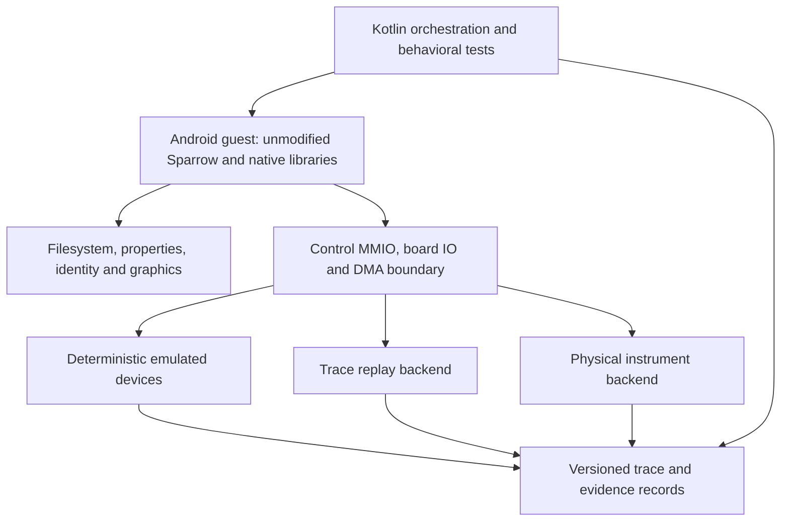

# MHO900 system boundary: reconnaissance

Inspected 2026-09-24. This is a research architecture proposal, not an implementation contract.
See [provenance](provenance.md) for input locations and [the experiment plan](emulation-plan.md) for progression gates.
The later [guest baseline](guest-baseline.md) establishes generic API-25 guest boot and an APK signing rejection;
the reconnaissance observations below retain their original scope.

## Result

We possess a useful stock application baseline, extensive bounded native experiments, and partial platform evidence.
We do not yet possess a demonstrated bootable stock Android environment, a Sparrow launch witness, or acquisition
traces from the incoming MHO984. Begin with the byte-identical stock APK on ARM64 Android 7.1/API 25, capturing the
first failure without hardware substitutes. Environment availability and package signing are the first gates.

The repository began as a clean bootstrap on `main`, with taskctl healthy and zero tasks, roadmaps, or epics.
There was no build, CI, emulator, or source implementation. External research inputs are available through the
untracked `local/reversing/` location.

## Evidence vocabulary

- **Observed:** inspected or hashed during this reconnaissance; static behavior is identified explicitly.
- **Prior bounded emulation:** existing experiment and result reviewed; not rerun during this pass.
- **External reference:** public third-party implementation, not original RIGOL source.
- **Inferred/proposed:** an explanation or design awaiting an experiment.
- **Unknown/physical:** unresolved, or requiring the actual instrument and measurement.

## What is established

### Application and platform

Observed using Android build-tools 35.0.0 against the normalized stock APK:

- Package `com.rigol.scope`; launch activity `com.rigol.scope.SplashActivity`.
- Only packaged native ABI: `arm64-v8a`; minimum and target SDK are 25; compile SDK is 29.
- Manifest version name is `00.01.00.00.00`, while the native ELF contains `00.01.00.00.26`.
  APK display metadata alone is therefore unsuitable as firmware identity.
- Manifest requests shared UID `android.uid.system`, plus several privileged permissions.
- `apksigner verify --print-certs` succeeds. Signer certificate SHA-256 is
  `f48e7189aac174df7fd19acf58b6d15832760fcf25ac0a6d4bcd5fc1974d4c03`.
  This identifies a certificate; it does not independently authenticate the download.
- Eight native libraries are packaged. Auklet directly needs Android, GLESv3, EGL, libc++, log, FFTW3f, libm,
  libdl, and libc. Graphics is part of the application boundary, not merely an eventual display convenience.

**Inference:** a generic guest may reject the shared system UID because its platform signing identity differs.
Android requires matching certificate sets for shared UIDs. This must be tested before investigating FPGA startup.
Moving the APK into a privileged directory is not evidence that the signature requirement has been satisfied.
See the [Android manifest specification][android-manifest].

RK3399, Android 7.1.2, and API 25 appear in the NK-distributed `build.prop` and prior initramfs/device-tree findings.
These are community-package platform evidence, not a freshly acquired stock MHO984 system partition. The stock APK's
API requirement independently supports choosing API 25, but cannot identify the complete installed operating system.

The `.26` update contains `app/`, `data/`, `driver/`, `FPGA/`, `MCU/`, `resource/`, `shell/`, and `tools/`.
No `vendor.bin` is recorded in its 2,650-file normalized manifest. This is not a full factory/per-unit filesystem.
The stock startup script configures FPGA power, PCIe/XDMA, SPI/AFE, GPIO, UART, calibration directories, and services.
It is evidence to read, not a host setup script to execute.

### Native hardware interfaces

The following are fresh static observations in the stock Auklet ELF identified by the provenance manifest.
Addresses are ELF virtual addresses before load bias; do not apply them as universal file offsets.

| Interface | Observed stock behavior | Modeling consequence |
| --- | --- | --- |
| `/dev/xdma0_bypass` | `Dev_PCIeInit` at `0x27017c`; `mmap` at `0x270280` requests 16 MiB. | Control mapping. |
| Register access | `Dev_WriteRegister` `0x2703c8`, `Dev_ReadRegister` `0x270594`: mapped stores/loads. | Model MMIO. |
| `/dev/xdma0_c2h_0` | Read path `DevAnalyzeTrace_Read` `0x270634`; fortified `read` at `0x2706b4`. | Separate stream. |
| `/dev/dma_auklet` | `DrvDMA_Init` `0x37de94`: 256 MiB mapping; destination = base + 128 MiB. | Separate buffers. |
| DMA operations | `DrvDMA_Copy` `0x37dfc8` issues ioctls. | Preserve ioctl semantics; layout still needs recovery. |
| AFE and board I/O | Stock shell loads SPI/AFE, GPIO, clock, fan and other drivers. | Independent device families. |

Both inspected mapping calls request read/write, shared mappings at offset zero. These are userspace requests,
not independent proof of physical BAR size or kernel allocation behavior. `Dev_PCIeInit` also has a 30,000-iteration
open retry loop with 1 ms sleeps. Its inspected mapping check compares with zero; `DrvDMA_Init` compares with -1.
An invalid mapping may therefore surface later as a crash. Preserve exact error outcomes instead of returning an
arbitrary fake pointer. The precise DMA ioctl payload layout and acquisition stream framing remain unknown here.

**Architecture consequence:** intercepting `open`, `read`, and `ioctl` alone cannot observe every register access
after `mmap`. A plain memory buffer also cannot implement read side effects, interrupt/completion semantics, or
deterministic write observation. Choose a measured native-function boundary or trapped MMIO/device model once a
trace establishes the required semantics. Do not assume the trace-read path covers every analog acquisition path.

### Model selection and prior experiments

The model-selection report and result files describe actual AArch64 initializer/parser/setter executions with
modeled strings, call-once behavior, license responses, and downstream setters. They cover 51 initialized records,
54 input strings for original and redirected behavior, and eight bandwidth-option combinations.

The reported stock records give MHO984 enum 17, MHO984D and MHO98 enum 18. The proposed redirect occupies 32 bytes
at ELF VA/file offset `0x42949c` and changes 27 byte values. It selects the existing D capability record while
retaining MHO984 identity. It is a bounded result, not an installed patch or measured analog bandwidth result.

The report traces startup model input to decoded vendor item 5 in `/rigol/data/vendor.bin`. The loader validates
encoded data and may rewrite files in recovery paths. Missing/unrecognized model input falls back to MHO934.
Consequently, an application that starts without factory data must not be labeled an MHO984 baseline solely
because a property or filename says MHO984. Verify the selected model and capability separately.

The three-way report covers 6,912 isolated bandwidth-policy executions and 384 packer cases per binary.
It distinguishes stock `.26` filter/delay changes from NK's broader policy mutations. NK's effective modified APK
is `resource/mod/apk/Sparrow.apk`; its bundled base APK is a `.24`-derived comparison specimen. Neither that base nor
an absent independent `.25` image supports attributing every `.24` to `.26` delta to one release.

These prior scripts write results into their own analysis directories. They were reviewed, not run in the protected
corpus. Any future reproduction must redirect all outputs and temporary state into this project's ignored areas.

## Proposed lab boundary

This is a target decomposition, not a claim that stock Sparrow already exposes an interchangeable backend API.
First preserve real Android/JNI/Bionic/graphics execution. Add narrow environment fixtures only at witnessed failure
boundaries. Keep control registers, DMA buffers/transfers, AFE/board peripherals, and identity/calibration separate.
Use deterministic logical event ordering with explicit timeouts, completion events, reset state, and seeds.
Unknown operations must produce an explicit unsupported result or trace failure, not silently succeed.

Kotlin should own typed manifests, orchestration, traces, and shared behavioral tests. Use sealed operation/result
types and explicit register offsets, byte counts, and device identities; `Any` is prohibited. A future small C ABI
should expose versioned fixed-width structures, opaque handles, explicit ownership/lifetimes, and error codes.
Do not export inferred C++ object layouts or unstable STL types to Kotlin/Native. ABI generation awaits evidence.

Inputs stay immutable outside the tracked source tree. Guest writes use disposable overlays under `local/` or
`out/`, especially vendor recovery, licensing, and calibration state. Each experiment binds input hashes, guest
image/configuration, fixture versions, tool versions, raw logs, and an explicit evidence category.

## Public reference assessment

[Orange-Rigol][orange] builds Debian/Ubuntu systems for RK3399-based DHO instruments. Its README reports testing
on DHO924S and says the oscilloscope application is not yet ported. It is useful board-support prior art, not a
ready-made MHO984 Android emulator.

The associated [4.4.179 kernel][kernel] is derived from OrangePiRK3399 work and also reports DHO924S testing.
At commit `d23adbd11626f12abaf4bc742e250204fe2b9f8a`, its tree includes `rk3399-rigol.dts`, SPI/AFE drivers, and
XDMA sources; `cdev_bypass.c` binds `.mmap` to `bridge_mmap`. This provides testable ABI leads, not proof of an
exact match to stock MHO900 modules. `rk3399-rigol.dts` contains a `dma_auklet` node with
`compatible = "rigol,dma_auklet"`. The recursive file-path search found no driver/source-file path named
`dma_auklet`; it did not establish whether a driver under another filename implements that binding.

The [U-Boot fork][uboot] reports RK3399/DHO924S use; retain it for future boot-chain questions. The linked
[5.10 kernel work][kernel510] is a separate reference. Neither is a prerequisite for the first APK experiment.
Reviewed commit identifiers for these repositories are recorded in [provenance](provenance.md).

## Unknowns that change the design

1. Can an obtainable ARM64/API-25 guest run on this host, and can it install the unmodified system-UID APK?
2. What is the first observed launch failure: permissions, framework service, JNI loading, graphics, files, or devices?
3. What minimum vendor/identity/FPGA-DNA inputs select a valid MHO984 state without triggering recovery writes?
4. Which registers have read/write side effects, busy/ready transitions, reset requirements, and timing dependencies?
5. What are the DMA ioctl layouts, buffer ownership/coherency rules, transfer framing, and completion mechanisms?
6. Can all required hardware accesses be captured at exported native boundaries, or are direct accesses widespread?
7. How do hardware revisions select bitstreams/AFE behavior, and what revision arrives on the bench?
8. Can MHO984D behavior be reconstructed beyond its model record without unavailable per-unit inputs?

Physical transfer function, calibration validity, analog bandwidth, board equivalence, and live acquisition
correctness remain bench questions. A synthetic waveform in the UI will validate a software path only.

[android-manifest]: https://developer.android.com/guide/topics/manifest/manifest-element
[orange]: https://github.com/norbertkiszka/Orange-Rigol
[kernel]: https://github.com/norbertkiszka/rigol-orangerigol-linux_4.4.179
[uboot]: https://github.com/norbertkiszka/rigol-orangerigol-uboot_2017.09_light
[kernel510]: https://github.com/norbertkiszka/Linux-5.10-Rockchip
