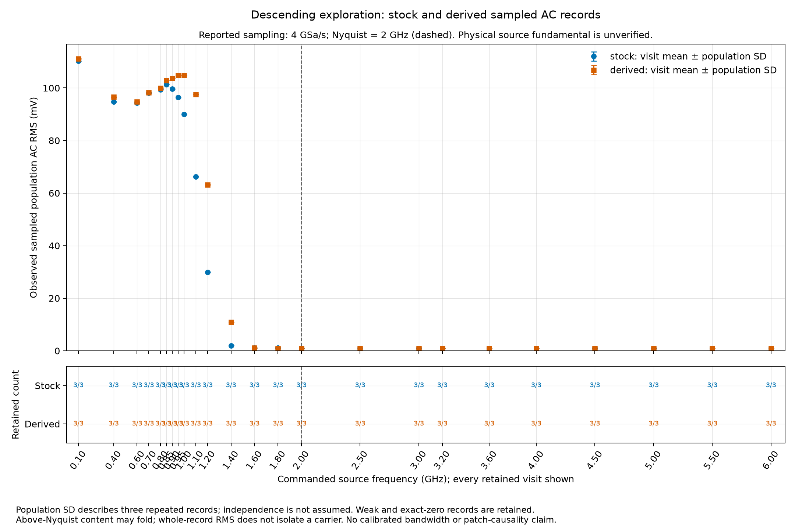

# Six GHz descending exploratory response

The operator requested a broad descending survey under the original and derived
software selections. This is a new exploratory experiment. The earlier failed
stock return control and the missing original comparison arms remain preserved.
These records do not fill or revise the frozen seventy-five-slot comparison.

Each arm uses the existing source-to-CH1 coax path, internal 50 ohm termination,
DC coupling, one-times probe ratio, zero offset, FULL bandwidth and normal
acquisition. The planned record profile is 50 mV/div, 100,000 RAW ASCII points
and a reported 4 GSa/s. Original ordinary, waveform-export and run settings are
saved and restored. The source uses raw power code zero throughout; that code
is not a calibrated output level.

The source command list, in MHz, is:

```text
6000, 5500, 5000, 4500, 4000, 3600, 3200, 3000,
2500, 2000, 1800, 1600, 1400, 1200, 1100, 1000,
950, 900, 850, 800, 700, 600, 400, 100
```

Every listed factory frame must pass the existing encoder, including its CR
delimiter exclusion, before a source port is opened. Each visit has one source
command and three separate RUN, wait, STOP acquisition positions. There is no
automatic command retry or replacement record. The planned final visit returns
the source to 100 MHz. After an early stopped prefix, a separate one-shot
100 MHz return is permitted only if the latest source attempt finalized with
all nine bytes accepted, no transport issue and a successful close, and fresh
registry identity still matches. No return is attempted after source ambiguity,
partial output, an unfinished intent, changed identity or an already attempted
final 100 MHz visit. Cleanup never supplies a missing visit or repeats an
ambiguous write. Its result, or the last held source command, remains explicit.

## Sampled observations

ASCII values are retained directly in volts. Adjacent preambles, exact original
response bytes, sample interval, record geometry and query provenance accompany
every complete record. The common amplitude metric is whole-record demeaned
population AC RMS. Finite, correctly framed, nonoverloaded weak or constant
records are valid exploratory outcomes. A minimum amplitude, a peak near the
commanded frequency or a return-amplitude threshold does not gate continuation.
Framing, nonfinite values, overload, software identity, protected-material,
capture, lease or ownership failures preserve the stopped prefix.

Under uniform sampling at the reported 4 GSa/s, the first Nyquist interval ends
at 2 GHz. The principal folded-frequency predictions include:

| Source command (GHz) | Principal alias (GHz) |
| --- | --- |
| 6.0 | 2.0 |
| 5.5 | 1.5 |
| 5.0 | 1.0 |
| 4.5 | 0.5 |
| 4.0 | 0.0 |
| 3.6 | 0.4 |
| 3.2 | 0.8 |
| 3.0 | 1.0 |
| 2.5 | 1.5 |
| 2.0 | 2.0 |

These are predictions under the reported clock, not independent identification
of a physical carrier. DC and Nyquist cases depend on sampling phase; zero AC
at an exact folding point need not mean the source or analog path is silent.
Source harmonics and other components can also fold. Results therefore report
the commanded frequency separately from the observed sampled spectrum and RMS.

## Software and evidence boundaries

The original arm must establish the original APK-backed native selection and
stock capability values. The derived arm must establish the exact previously
approved standalone native bytes, mapping and derived capability values after
one normal reboot. Stock restoration removes only the file whose introduction
is proven, followed by one normal reboot and stock verification. The signed
APK, firmware images, option/license material and calibration remain preserved.

Each actual arm has a fresh full Layer Two capture in the existing isolated
Linux namespace. Its DHCP service supplies only the specimen's private lease,
without a gateway or DNS. Recorded owned processes, graceful capture closure,
drop statistics and retirement evidence are retained. The Mac controls only
the existing USB serial source; its routing table is not a bench dependency.

Stock results are sealed and committed before the derived transition. Every
result uses the same numerical metric, with no exclusion of inconvenient
records or substitution of fitted peak amplitude for RMS. Arm differences are
descriptive until source/path and temporal repeatability support attribution.
This survey can reveal where a narrower follow-up is useful. It does not by
itself establish a calibrated analog bandwidth or a physical six GHz waveform.

## Recorder invocation checkpoint

The first current-software collector launch stopped before contact. Its outer
supervisor supplied the recorder duration as a positional argument; the pinned
recorder requires `--duration`. Click rejected that command before its callback,
so no capture, DHCP helper, ADB server, specimen connection or source write
started. A subsequent host-only check found no namespace processes or listeners.
The stopped run is preserved separately as
`out/rf/descending-native-current-stopped-01.toml`.

The narrow remedy adds the required recorder option. The DHCP wrapper still
receives only its output argument. Pure checks exercise the actual pinned Click
commands with their physical callbacks replaced by recording spies. The original
preparation remains immutable; a fresh run identity and exact amended source
pin precede another launch. This checkpoint supplies no software or RF result.

The corrected collector armed its capture and reached an ADB connection. It
then stopped because bootstrap servicing had consumed the capture prefix before
the lifecycle decoder was constructed. That decoder received later packet bytes
where it required a PCAP header. No policy read, native change or RF source
command followed. The captured connection is preserved; this is a host stream
handoff failure rather than evidence that ADB was unavailable.

The second stopped run, `out/rf/descending-native-current-stopped-02.toml`,
retains twelve captured frames, zero reported kernel drops and graceful recorder
and DHCP exits. Owned ADB retirement precedes DHCP and capture retirement; a
fresh host check records no remaining namespace processes or listeners. The
handoff remedy gives the lifecycle its own forward capture cursor while retaining
the outer wire validator's independent cursor and all packet acceptance rules.

The next collector reached UID zero and retained current package, maps, APK and
full protected-corpus bytes, then stopped on a literal missing-file result for
the expected enforcement-status path. Its stopped seal is
`out/rf/descending-native-current-stopped-03.toml`. The subsequent narrow
observation distinguishes a readable zero, a readable one and confirmed path
absence. Absence does not establish that enforcement is disabled. Existing
unreadable or linked paths, command failures and malformed replies remain errors.
The exact observation bytes must stay unchanged across the current check and
native transition. No policy setting is changed. No native policy reader or RF
source command occurred in this stopped run; owned helpers again retired.

The fourth collector passed the fresh stock software snapshot and then rejected
normal ADB transfer progress printed on stderr, despite a zero return code.
The policy-reader file had been transferred, but no reader was launched. Its
private stage is quarantined. The stopped inventory,
`out/rf/descending-native-current-stopped-04.toml`, retains the original stop and
retirement uncertainty: the original ADB wait status was not recorded. Later
process and active-endpoint absence do not supply that missing exit status.
Recorded capture and DHCP owners were subsequently closed gracefully, with
29,992 captured frames and zero reported kernel drops.

The remedy recognizes only the exact successful single-file transfer diagnostic,
bound to the source path and byte count. Owner, mode, size and byte roundtrip
checks still precede reader execution. Owned-server retirement now records the
actual wait result first and, after a proved zero exit, observes socket closure
for at most five seconds while servicing the remaining capture and lease owners.
A fresh collector identity and pinned runtime precede execution. No native
selection or RF source command occurred in the fourth stopped run.

The fifth collector ran the stock policy reader and reached the unchanged
fixed-size observation validator. Independent replay establishes stock raw and
effective selection 17/17 in the same process and boot epoch. Its lifecycle
archive contains the five expected files as `./argv`, `./pid`, `./start.stat`,
`./go` and `./exit`. The collector's generic corpus reader preserved those
prefixes while its lifecycle membership check expected bare names. The raw
archive is preserved in `out/rf/descending-native-current-stopped-05.toml`.

The reader exited zero, its process absence and helper removal were recorded,
and owned server, DHCP and capture retirement completed. No UI witness, final
snapshot, native selection or RF source command followed. A separate lifecycle
archive parser now handles that exact flat archive grammar; protected-corpus
member naming and all reader identity, argument, exit and absence checks remain
unchanged. This resolves a host evidence-format seam, not a stock policy failure.

The fresh current-software run then completed. Before and final snapshots retain
the exact stock signed APK, APK-backed native mapping, process and boot epoch,
identity/status replies and complete protected corpus. Two fixed-size samples
establish raw and effective stock selection 17/17. The reviewed screenshot shows
the normal oscilloscope UI. The capture contains 60,321 frames, matching final
capture statistics with zero reported kernel drops, and owned helpers retired
with recorded zero exits. This establishes the current stock software state;
it contains no descending RF records.

The two-arm survey retains a finite completion budget and the full reserves for
both native transitions and final stock restoration. A separate timing fixture
extends that selected budget by one hour after the collector remedies. Per-leg
durations, the 1,801-second serviced warm-up, single-reboot rule, 7,320-second
pre-deployment reserve and captured lease expiry remain unchanged. Earlier
fixtures and stopped runs remain immutable.

## Completed stock survey

The stock arm completed all twenty-four source visits and seventy-two records,
with three records per visit and no retries. Every record is finite, correctly
framed and within the planned headroom; none is missing, partial or invalid.
The reported sample rate is 4 GSa/s throughout. The source's final planned
command is 100 MHz, and the saved ordinary, export and run settings were restored.
The capture contains 41,179 frames, matching its final received count with zero
reported kernel drops. Recorded owned helpers exited and the isolated namespace
retains only its connected bench route, with no active management sockets.

The following values are whole-record population AC RMS, averaged across the
three records. They describe the source, cable and sampled instrument chain.

| Source command | Stock mean AC RMS | Largest sampled bin |
| --- | ---: | ---: |
| 6 GHz | 0.902 mV | 100 MHz |
| 1.6 GHz | 1.055 mV | 75 MHz |
| 1.4 GHz | 2.000 mV | 1,400.04 MHz |
| 1.2 GHz | 29.970 mV | 1,200.04 MHz |
| 1.1 GHz | 66.294 mV | 1,100.04 MHz |
| 1 GHz | 89.943 mV | 1,000.04 MHz |
| 800 MHz | 99.363 mV | 800 MHz |
| 100 MHz | 110.316 mV | 100 MHz |

This establishes substantial sampled reception at the nominal 1 GHz command
under stock selection. The higher commands retain small residual responses;
from 6 GHz through 1.6 GHz, the largest bins are near 75 or 100 MHz, rather than
the hypothetical carrier or its principal alias. The 6 GHz record therefore
does not establish reception of a physical 6 GHz fundamental. A serial write
does not independently verify the source's RF output. These data also do not
establish a calibrated analog bandwidth or a derived-selection benefit.

The immutable actual inventory is `out/rf/descending-stock03-actual-01.toml`
(`8c48d9710d332c58a694421702f4401b7960efd10288b8593c209691ba7af12c`).
The separately sealed numerical inventory is
`out/rf/descending-stock03-analysis-01.toml`
(`2abc07db9e6b774102442580104c2afee23a6aa6c3d3db16cdfa3dbf6599922a`),
with every planned position and original-voltage result retained. The complete
frequency table and execution witness are preserved in
`out/rf/descending-stock03-reduction-execution-01.toml`
(`694905d44fa278deecb5724481d0231506820ecd7a8c7308ed3d085a849db07d`).
The independent acquisition review is
`out/rf/descending-stock03-actual-independent-01.toml`
(`346c4ac197f935bcdc1b1a18291c4258c9e3bde3f39d10ad00d18d77ff8c1a57`).
It reconstructs all 1,469 SCPI requests and their responses from the capture,
binds the three stock metadata checks, checks restoration and recorded helper
retirement, and independently recomputes every RAW scalar and group statistic.
The stock metadata checks preserve the admitted process and mappings; they do
not constitute a new backing-file hash acquisition at every RF record.

The first derived launch stopped during host bootstrap, before ADB startup or
any native change, reboot or source command. A dynamically constructed health
model retained the earlier deadline cap. Its capture and DHCP owners were
identified by PID, birth, arguments and namespace, then retired through pidfds.
Their recorded child closures and the empty capture's zero drop statistics are
preserved. The original supervisor wait statuses are unavailable and remain
explicitly unknown. The stopped inventory is
`out/rf/descending-native-derived-stopped-01.toml`
(`e788da610c6433661bdeee813f8d427487896fa2c2178e235a659fe1b463da39`).

A separately admitted correction changes only that deadline validation bound
and binds a fresh run identity. Pure controls construct the exact concrete
health model with labelled synthetic owners; the original rejects the selected
deadline and the corrected model accepts it. Other guards and warm-up and
restoration reserves remain unchanged. Independent review
`out/rf/descending-health-cap-independent-01.toml`
(`338d014f5e3135f803ce9a891fb64872fef78f4d71832240cfff05e4feb39584`)
accepts the fresh configuration and host-only validation. It acknowledges the
late constructor check missed by the earlier conditional preparation review.
This correction supplies no physical derived result.

## Interrupted derived boot observation

The second derived transition recorded the exact sidecar introduction and issued
one normal reboot request. Its boot observation stopped on a peer-origin IPv6
packet whose base Next Header is Hop-by-Hop, rather than directly ICMPv6. The
retained packet decodes as a link-local multicast-listener report. This is a
capture-classification limitation; it is not evidence of external reachability
or a failed RF channel. [RFC 3810](https://www.rfc-editor.org/rfc/rfc3810.html)
describes the Hop-by-Hop Router Alert used by these local reports.

The reboot CLI was interrupted with recorded return code -15 and remains
unproven as a completed command. Postboot software, UI, policy and RF acceptance
are absent. The capture does retain subsequent DHCP traffic; its independent
interpretation and a fresh current-epoch check are separate requirements.
The owned ADB server was reaped with exit zero. The four remaining capture and
DHCP owners were positively identified and gracefully retired; child closures
are zero, while original supervisor wait statuses are explicitly unavailable.
The final capture reports 87,160 captured and received packets with zero kernel
drops. Host observations retain only the isolated connected route, forwarding
disabled and no remaining namespace processes or sockets.

The complete stopped inventory is
`out/rf/descending-native-derived-stopped-02.toml`
(`3b526cdfa84cbe0fed1b3bddf36f9b0c29b6d4b694eb6a563a23ebe760f27681`).
Separately admitted postboot tasking permits a narrowly classified local report
and observation of the already-introduced derived selection. It has no native
transaction or reboot route. It retains a bounded observation period, full
software and corpus checks, serviced warm-up and final stock restoration.
It cannot turn the interrupted transition into a completed result.

Independent review of the complete stopped capture confirms nine checksum-valid
local reports: five link-local and four unspecified IPv6 sources. All other
frames pass the existing classifier. It also reconstructs one reboot service
request followed by a fresh paired 86,400-second DHCP lease, with no gateway or
DNS options and no later release or decline. Review inventory
`out/rf/descending-derived02-stop-independent-01.toml`
(`a7476fcb2b4ac7c5d71e8d56631618755c5be9487b07f193b09c25f565989da5`)
preserves the interrupted command and missing software acceptance.

The separate postboot fixture accepts only those witnessed report structures,
checks their lengths and checksums, and rejects unrelated extensions. Its
controller has no native transaction route and rejects normal reboot requests.
Independent preparation review
`out/rf/descending-postboot-independent-preparation-01.toml`
(`e7222e40da173e51873d31d8e4f2df94b18e08b9f4b0046d066cd92455eacabe`)
accepts the actual packet controls, copied configuration pins and the host-only
validation. Fresh binding inventory
`out/rf/descending-postboot-bindings-01.toml`
(`6648103d9accaacc719f9ffe839d5a02b0a80d80f77bf7bf8ccfde3b79d9ac3c`)
retains the current lease and original introduction lineage. It supplies no
future process, UI or policy result.

This present-state observation has its own 3,000-second cap and requires 6,320
seconds remaining at entry. While it runs, 4,320 seconds remain reserved for
the unchanged survey, final stock restoration and cleanup. The original
deployment and restoration limits remain unchanged. The observation does not
retry the interrupted native transition.

The first separate postboot observation stopped at its 90-second screenshot
review deadline. The reviewer subsequently viewed the normal UI and wrote a token,
but that token arrived after controller closure and is not acceptance for the
stopped run. Its settled software snapshot and serviced 60-second interval
are retained; the 1,801-second warm-up, fixed policy observation and derived
RF records are absent. The source remained at 100 MHz, with no native
transaction or reboot in this observation.

The complete stopped inventory is
`out/rf/descending-postboot-stopped-01.toml`
(`caca230d4bf5c0b59d54bcf0ea5fecb16406df0f839f645a4572532a8a3de33d`).
The capture reports 37,683 captured and received packets with zero kernel
drops. Owned server, DHCP and capture closure receipts report exit zero;
the final namespace observation has no management socket or owned helper.
The late review is preserved separately in
`out/rf/descending-postboot-stop-note-01.toml`
(`33653dfc225177dce81ad520c3e00589e0d66f677d384740f799df726d78bee3`).

A newly admitted coordination batch permits one fresh present-state
observation with a 600-second serviced screenshot-review window, retaining
90-second token freshness and the 3,000-second observation cap. It extends
the local finite completion boundary from 04:20 to 04:40 UTC on October 3,
2026 to preserve time for review and final stock restoration. Full software,
protected-corpus, warm-up, policy, isolation and RF requirements remain.
This successor cannot introduce or remove a native library, reboot the
instrument, change the source, or retroactively complete a stopped run.

Independent stopped-observation review
`out/rf/descending-postboot-stopped-independent-01.toml`
(`77fbf629fcb11f5a280438fde16d9f97a7cf9d5fcacf9d5a9c94f27f8742b90b`)
accepts the partial software snapshot and cleanup. It confirms the token arrived
98.1807559 seconds after capture closure, and holds derived RF admission.
The final host audit includes its own transient process context; socket absence
and owned-helper retirement do not imply that every namespace PID was absent.

The successor preparation changes three modules and preserves 27 other module
bytes. It adds a strict elapsed-time check before reading a late token. Two
fully consumed review windows plus settling and warm-up would exceed the
unchanged observation cap; the longer window cannot override that cap.
Independent preparation inventory
`out/rf/descending-postboot-independent-preparation-02.toml`
(`76fb67bc79b12ab30d74a5b1cef1476b44c834092b29818d2b8ab6ceed9afda6`)
verifies the injected timing controls, 50 concrete copied pins and host-only
static validation. Concrete binding inventory
`out/rf/descending-postboot-bindings-02.toml`
(`3a7eb4537cc5284490e90b0ff5708a607996d69cbd293ff8fd3de760e971549e`)
contains no future acceptance.

The remaining RF and stock-restoration builders keep separate authorities:
current software, UI and policy must come from an accepted new observation;
introduction and captured lease authority remain the original interrupted
transition. The finite timing extension changes three RF clock constants and
the native clock cap with dependent hashes. The frequency schedule, record
count, source commands, ordinary settings, final stock transaction and
warm-up requirements remain unchanged.

The fresh present-state observation completed. Its complete inventory is
`out/rf/descending-postboot-actual-02.toml`
(`7489986e061716bdc7611638470c4540e7f527bbfeb3afab4eb31adb35ff9be9`),
with independent review
`out/rf/descending-postboot-actual-independent-02.toml`
(`748a75e5479393f87876d79dfa301fdc73734bca8d3d1f234c5134c292651467`).
Three snapshots preserve the expected derived native mapping, stock APK and
protected corpus in one process and boot epoch. Both screens were reviewed
within their windows. The serviced warm-up exceeded 1,801 seconds; the final
fixed 16-byte observation reads raw/effective bandwidth 18/18. The observation
introduced no library, reboot or source command.

The capture contains 115,885 complete frames, matching the recorder's received
count, with zero reported kernel drops. All management streams are contiguous
and close in both directions. The 68 numbered CLI operations and 36 snapshot
SCPI queries are retained. Owned ADB, DHCP and capture processes close with
exit zero; the final host observation retains only the isolated connected
route, disabled forwarding and no management sockets.

An offline review-reader defect was corrected before actual review: it had
mistaken the three-process bootstrap observation for retirement. The fresh
reader distinguishes bootstrap, managed and retired phases, checks exact
ownership, and requires recorded successful server retirement before accepting
the final three-process subset. Independent supplied-data controls pass. Its
archive timestamp boundary retains whole-second precision; packet closure
and complete retirement are checked separately. The physical controller was
unchanged. This accepted observation permits the unchanged derived descent;
the original interrupted introduction remains a separate historical event.

Concrete RF preflight then rejected a stale exact lease-expiry literal in the
inherited controller. The new configuration binds the actual post-reboot
24-hour lease, but the constructor still required the earlier lease value.
Independent concrete review
`out/rf/descending-concrete-independent-01.toml`
(`35808d947a5c946d178218203bd0df0969f200f6c492635b759c4deb9e64c405`)
preserves that rejection and separately accepts the final-stock file
composition. The unused host uploads are preserved; no derived RF acquisition
started from them.

A bounded remedy admits the exact witnessed expiry and matching Mac metadata,
with a future completion cap of 05:00 UTC to preserve review and stock-return
time. It retains the same source schedule, acquisition settings, record count,
measurement, 1,801-second stock warm-up and 3,000-second native leg cap. Earlier
captures, completed observation and failed preflight remain immutable. Fresh
complete concrete and host-only validation are required before execution.

The exact lease remedy passed independent concrete review before execution.
The fresh preparation inventory is
`out/rf/descending-lease-remedy-01.toml`
(`6a767c02fe4c8fa166486b1650997988e867c45952378746b884119a03a6ae66`),
with independent review
`out/rf/descending-lease-remedy-independent-01.toml`
(`c4bfaa4e1ec88a811a138bb175e02552ea080cfc3e2ee156cd135363e052ea67`).
Every other executable module remains byte-identical; complete constructors,
source deltas, dependent pins and four positive/negative control methods pass.

The complete host upload and static check inventory is
`out/rf/descending-lease-host-staging-01.toml`
(`c59a8278a48f7ae7addf6d373e38290d505338d0e607e66cadb649f8471e4cae`).
All 29 RF and 51 native upload files match. The isolated namespace has no
existing controller owners, and the recorded preflight retains 4,962.68 seconds
against the required 4,800-second reserve. This accepts the file composition
and host preparation for one unchanged derived descent and final stock return;
it does not assert either future physical outcome.

The derived descent completed its producer boundary with 72 RAW records and
24 finalized source commands. The last planned command is 100 MHz. The scope
restoration receipt reports exact saved ordinary and export settings; the
source parent, remote coordinator and owned server exit with status zero.
The separate completed inventory is
`out/rf/descending-derived-rf-actual-01.toml`
(`e9ca174d28179c27f7bd2ae0c16029471736dcc9cc9b15e1b24c3a05f159ef66`),
covering 83,797 files and 349,299,120 bytes. Its lossless archive hashes to
`60a9d6c55ddeb692127de2ccc6f602875fc354576578cfc45542731459d5117e`.
The recorder stores 41,324 frames, matching its received count, with zero
reported kernel drops. Independent full protocol review and numerical
interpretation follow separately.

A fresh host-only closure inventory,
`out/rf/descending-derived-rf-host-closure-01.toml`
(`7a09854fac5f0d562d2668f9f468fd081e82c9086c34fcb96a3e01e10dae8e96`),
records disabled IPv4 and IPv6 forwarding, no remaining namespace owners and
no TCP sockets before the stock return. It supplements the original immutable
collection; it does not rewrite its capture or claim a new specimen query.
The next action is the admitted exact introduced-library removal and normal
stock reboot, followed by the unchanged stability and policy checks.

The full derived acquisition independently passes the frozen protocol, wire
and retirement readers. Review inventory
`out/rf/descending-derived-rf-actual-independent-01.toml`
(`168478ede0d1aa500c8a9a2d611cf7d5a77c5848056f1eaba3507049baf444ff`)
validates all 72 records, 24 commands, three unchanged metadata epochs, the
complete SCPI sequence and paired stream closure. Numerical reduction and
the paired response table are sealed separately.

The first stock-return invocation then stopped in host argument parsing; the
corrected argument invocation stopped at the namespace inode check before
bootstrap could spawn capture, DHCP or ADB. The original stopped output
contains only its isolation hold marker. No introduced library was removed
and no reboot occurred. The preserved inventory is
`out/rf/descending-final-stock-preflight-stopped-01.toml`
(`f78de410976880a331b525fe2472d84d9c1a66610ad0a9cdffb58b0d23fed92a`).

The bounded correction gives the unchanged stock return a fresh run identity
and explicitly enters the existing bench namespace before invoking its
coordinator with both required arguments. A finite 05:20 UTC restoration cap
retains the original transition and warm-up reserve while this host-only
correction is reviewed. Only future native clock bounds and their dependent
pins may change; both completed RF passes and their earlier caps stay
immutable. This is a corrected host entry, with no physical retry to conceal.

The completed paired survey retains every planned point: 24 frequencies and
three records per frequency in each arm. The table below gives the observed
whole-record demeaned population AC RMS in mV. The ratio is derived/stock.
All records report 4 GSa/s; no original 75-slot comparison slots are filled.



| Command MHz | Stock mean mV | Derived mean mV | Ratio | Records per arm |
|---:|---:|---:|---:|---:|
| 6000 | 0.902369 | 0.920555 | 1.020154 | 3 / 3 |
| 5500 | 0.909966 | 0.923179 | 1.014520 | 3 / 3 |
| 5000 | 0.911328 | 0.930458 | 1.020991 | 3 / 3 |
| 4500 | 0.926476 | 0.949237 | 1.024568 | 3 / 3 |
| 4000 | 0.922817 | 1.000055 | 1.083698 | 3 / 3 |
| 3600 | 0.942262 | 0.995587 | 1.056592 | 3 / 3 |
| 3200 | 0.967895 | 0.978298 | 1.010748 | 3 / 3 |
| 3000 | 0.947096 | 0.975415 | 1.029901 | 3 / 3 |
| 2500 | 0.933650 | 0.993106 | 1.063681 | 3 / 3 |
| 2000 | 0.955494 | 0.973869 | 1.019230 | 3 / 3 |
| 1800 | 1.038845 | 1.024863 | 0.986540 | 3 / 3 |
| 1600 | 1.054964 | 1.080586 | 1.024287 | 3 / 3 |
| 1400 | 2.000270 | 10.937937 | 5.468232 | 3 / 3 |
| 1200 | 29.969565 | 63.191009 | 2.108506 | 3 / 3 |
| 1100 | 66.294129 | 97.485228 | 1.470496 | 3 / 3 |
| 1000 | 89.942540 | 104.838933 | 1.165621 | 3 / 3 |
| 950 | 96.364989 | 104.798956 | 1.087521 | 3 / 3 |
| 900 | 99.655792 | 103.689537 | 1.040477 | 3 / 3 |
| 850 | 101.366683 | 102.876896 | 1.014899 | 3 / 3 |
| 800 | 99.362605 | 99.982388 | 1.006238 | 3 / 3 |
| 700 | 98.069136 | 98.317026 | 1.002528 | 3 / 3 |
| 600 | 94.291666 | 94.705686 | 1.004391 | 3 / 3 |
| 400 | 94.712194 | 96.615430 | 1.020095 | 3 / 3 |
| 100 | 110.315759 | 111.126231 | 1.007347 | 3 / 3 |

At 800 MHz, the means differ by 0.62%; at 1 GHz the derived mean is 16.56%
higher, at 1.1 GHz 47.05% higher, and at 1.2 GHz 110.85% higher. Below
800 MHz the arms are close; their separation grows around the stock
response decline. This is useful evidence of an observed response change
associated with the two software selections under the same commanded
source sequence and acquisition settings.

At the commanded 6 GHz point both sampled RMS means are below 1 mV,
and the strongest sampled component in both arms is 100 MHz. This does
not establish reception of a 6 GHz carrier. A hypothetical 6 GHz sinusoid
at the reported sample rate would fold to 2 GHz; harmonics and other
content remain ambiguous above the 2 GHz Nyquist boundary.

These are two chronological exploratory passes. Source level and spectral
quality are unqualified, whole-record RMS includes all sampled content,
and three-record population SD does not establish independence. The
results support a selective response difference; they establish neither
calibrated analog bandwidth nor a causal attribution that excludes source
drift. The final stock return is a restoration check, without a third RF
pass. The incomplete frozen A1/B/A2 comparison remains distinct.

The [comparison CSV](rf-descending-stock-derived.csv) preserves all means,
population SDs, counts, differences and ratios. The [SVG figure](figures/rf-descending-stock-derived.svg)
is retained for export. The numerical inventories are:

- Derived reduction: `out/rf/descending-derived-rf-analysis-01.toml`
  (`6d70abed7be8c1dc7cee747ada7e77590e242deaf64314e9782078cf6d0acbb4`).
- Matched comparison: `out/rf/descending-stock-derived-comparison-01.toml`
  (`8f55c2fc7920ff61350e75562e21eed45f54886c797fa3de2ae6091a8ac7cb16`).
- Figure: `out/rf/descending-stock-derived-figure-01.toml`
  (`c5ea84fcd4d08d526860419f3c0467e5d6786fd20abaad1aa8a4c74286c3f14d`).
- Execution and full spectral table: `out/rf/descending-derived-rf-reduction-execution-01.toml`
  (`ba60bb9d9d30651cf00f7b59ceebc06a1fc237265459c1b38a3ad80efa20c216`).

The fresh stock-return entry is now admitted. It explicitly enters the
isolated Linux namespace and supplies both coordinator arguments. The
complete binding is sealed as `5487b678b87a4d0c2275fb2daa4ea9f02ed2f4acc82ad766798761b73d90eac7`;
the independent file review is
`c16fe0346cfe88dbefa18256385bdbb40d5bf08f5922cb233795859b419d8baa`.
Host staging and static validation are sealed as
`58f770a8858f0ee4308199c2b21c24be4c36f7f2d647c90fcb09b3f87d4a7c37`.
The recorded reserve exceeds the required 3120 seconds, with no prior
namespace owner or TCP socket and forwarding disabled. The only executable
change is the finite restoration health deadline; removal, one normal
reboot, protected corpus, policy observations and serviced warm-up remain
unchanged. These are preparation facts. Actual restoration requires its
own completed evidence and independent review.

The final-stock02 transition stopped at its first postboot Sparrow PID
query. Its sealed prefix records removal of the introduced sidecar, one
normal reboot, renewed DHCP and UID 2000; `pidof` returned a remote exit
status of 1. No conditional-root attempt followed, and no reboot was
repeated. Complete stopped evidence is sealed as
`6c8706a7f89af8eca8ff86909aa092d3d4b7beea40ccfa0f21357311363b2872`.
A separate host-only closure record,
`6263769eda78197bd00c207e4859c32b4fd66596678419b7cfc617d9589eadca`,
records no namespace owners or TCP sockets and forwarding disabled.

A bounded successor will observe the settled stock boot without another
native-file change or reboot. It must bind the actual stopped-removal and
new lease evidence, discover the new process once, and verify the existing
stock mapping, protected corpus, normal UI, policy 17/17 and serviced
warm-up. The still-unused conditional UID-first root sequence remains
limited to one attempt. The finite 05:20 UTC deadline is unchanged. The
interrupted transition remains a stopped result even if this separate
observation later proves current stock readiness.
