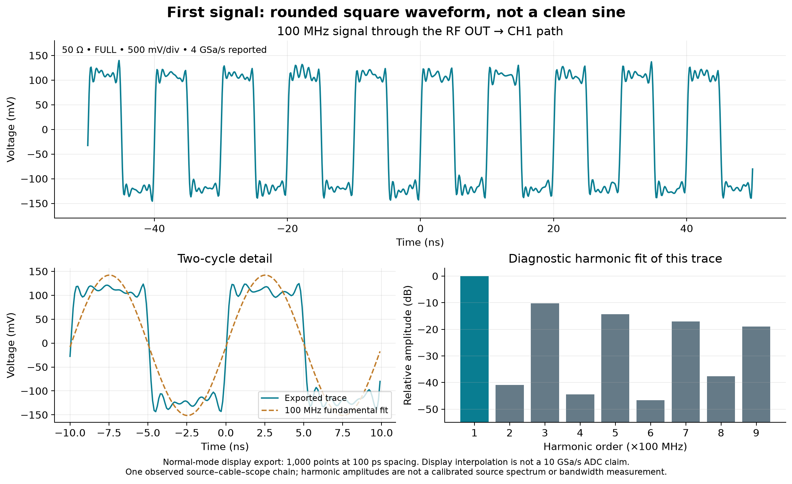

# The first exported RF waveform

2026-10-01. One display export at the unchanged pilot settings confirms a
square-like trace with ripple and strong odd harmonics. It follows the separately
preserved [first signal run](rf-first-signal.md), whose optional fall-time query
returned an unusable value before export. No second source command was sent.



## Acquisition and interpretation

The new task was admitted and pushed as `72d6190` before execution. The source
remained powered at the existing 100 MHz setting, connected to CH1. Fresh SCPI
readback confirmed the same 50-ohm, DC, 1x, full-bandwidth channel, 500 mV/div,
10 ns/div, normal acquisition and 4 GSa/s conditions. Identity and all queried
channel, timebase, acquisition and trigger fields matched after export.

The waveform export was already CH1 / Normal / 1,000 points, spanning points
1 through 1,000, with WORD format. Only its format changed: WORD to ASCII for
one `:WAVeform:DATA?` request, then back to WORD with readback. The complete
14,000-byte response contains 1,000 voltage values. Preambles before and after
were identical:

```text
2,0,1000,1,1.000000E-10,-5.000000E-8,0.000000,6.6667E-05,0,32768
```

The official programming guide, section 3.28, specifies actual voltages for
ASCII data, so no BYTE/WORD vertical conversion was applied. The preamble
places these display points 100 ps apart, beginning at -50 ns. This is a
**display grid**, not evidence of a 10 GSa/s ADC. The separately queried
acquisition rate remained 4 GSa/s. No raw acquisition-memory export occurred.

| Quantity from this display record | Value |
| --- | --- |
| Minimum / maximum | -145.6 mV / +139.8 mV |
| Peak-to-peak voltage | 285.4 mV |
| RMS voltage, including DC | 112.57 mV |
| Mean voltage | -4.59 mV |
| Number of points | 1,000 |
| Display interval | 100 ps |

For a diagnostic shape check, least squares fitted a constant plus sine/cosine
pairs at the nominal 100 MHz fundamental and its harmonics through order nine.
An exact-bin synthetic control independently checked recovery of known DC,
fundamental and third-harmonic amplitudes. Relative amplitudes in the observed
trace were approximately -10.2 dB at the third harmonic, -14.3 dB at the fifth,
-17.0 dB at the seventh and -19.0 dB at the ninth. The fit residual was about
10.1 mV RMS. These are descriptive values from one display record of the entire
source, cable and scope path, with no spectral calibration or uncertainty budget.
They are not the source's independent harmonic specifications.

A divided synthesizer output is a plausible source of this shape: the
[MAX2871 documentation](https://www.analog.com/en/products/max2871.html)
describes a VCO followed by programmable output dividers. The photographed RF
IC marking and board family support investigating that explanation, but this
run did not observe divider programming or isolate the cause of the ripple.

## Preservation and final state

The full capture began before isolated host addressing. The earlier six-hour
private lease remained valid, and forwarding, route and host-isolation checks
passed before and after. No gateway or DNS service was introduced. The helper
and temporary host address were cleaned up after the read.

There were 75 requests and 73 responses: the two writes selected and restored
the export format. Both retained application streams match the packet capture
exactly. The recorder exited zero after SIGINT and reported **281 captured,
281 received by its filter, zero kernel drops**. Offline assessment accepted
the 281 stored frames. These observations do not establish absolute wire
completeness.

The private run `out/rf/display-waveform-20261001T215800Z` contains transcripts,
host baselines, waveform and preambles, controller and reduction source,
analysis output, plots and an exact inventory of 215 files. The source run and
the earlier stopped experiment remain separately sealed.

| Artifact | SHA-256 |
| --- | --- |
| Complete run manifest | `4cd1863901975edffecef900eb018db6e6e3cfcb27f3bb9c3c54c68163c88b96` |
| Packet capture | `da561db5cdd5497cc9ec2b99ed9029e10ba4d13d309acec58069057cdc58060d` |

The manifest was verified after creation. The source remains powered, the scope
retains its pilot settings, and the original waveform-export format is restored.
No source command, frequency sweep, acquisition-setting change, firmware change,
calibration, reboot or additional physical transition occurred in this run.

## Decision

The workstation can now obtain an interpretable voltage-versus-time display
record from the connected source and scope. The observed square-like shape is
material to the RF experiment design: peak-to-peak amplitude mixes the
fundamental and harmonics, whose relative attenuation changes the waveform.
Use fundamental amplitude for the policy comparison, while retaining harmonic
content and residuals as diagnostics.

The next integration question is a raw acquisition-memory export at a better
filled vertical range, with actual sample interval and record-length evidence.
That would support the frozen estimator and comparison protocol. It should be
a separately prepared run; neither seeing a ninth-harmonic component in this
trace nor obtaining a 100 MHz waveform establishes 1 GHz bandwidth. The existing
inventory, source qualification limits and matched-policy RF gates remain open.
