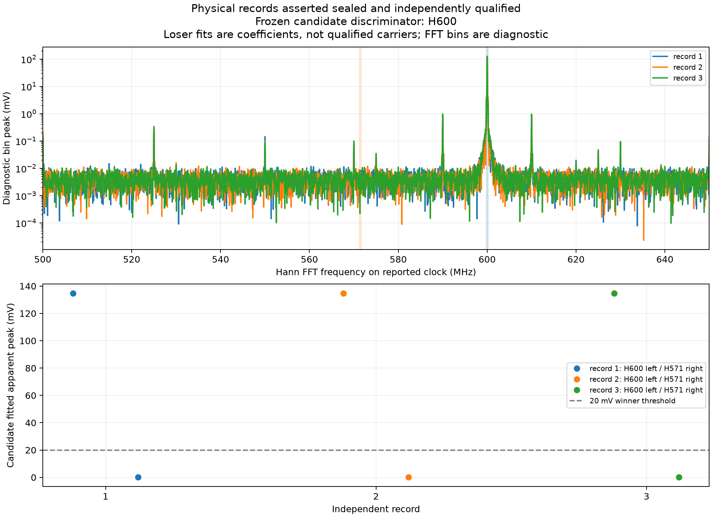

# 600 MHz receive-frequency discriminator

2026-10-01. The separately [frozen experiment](rf-frequency-diagnostic-protocol.md)
retained three fresh raw records with the source left at its previous commanded
600 MHz. No new source command was sent. The experiment completed and restored
the original scope acquisition/export settings and host isolation.

## Direct observations

| Experiment | Timebase | Built-in SCPI frequency |
| --- | --- | --- |
| Earlier partial survey | 1 microsecond/div | 571.43 MHz |
| This discriminator, before raw exports | 1 microsecond/div | 666.67 MHz |
| This discriminator, after raw exports | 10 ns/div | 625.00 MHz |

The paired measurements in this experiment used the same 50 mV/div scale,
reported 4 GSa/s, CH1 with internal 50 ohms, DC, 1x, zero offset and FULL
bandwidth. Vpp was 279.39 mV at 1 microsecond/div and 271.86 mV at 10 ns/div.
Neither a serial acknowledgement nor external frequency reference was acquired.
These observations distinguish the prior survey readback from this run; they
do not establish a specific frequency-measurement algorithm.

All three raw exports retained matching preambles, 100,000 finite ASCII voltages
and 250 ps interval with separate RUN/settle/STOP cycles. The typed waveform CLI
qualified each record independently, and file bytes exactly match the retained
raw socket responses. Numerical interpretation follows only after sealing.

## Preservation and final state

The capture retained 4,776 frames and reported 4,776 packets received by the
filter with zero kernel drops. Recorder and lease-helper termination were
graceful with exit zero. All 132 request files and 102 response files matched
reconstructed SCPI streams, including 4,201,142 response bytes and FIN closure.
A capture-consistent transcript does not independently prove wire completeness.

Original scope and export readbacks matched after restoration: 500 mV/div,
10 ns/div, 10k memory, running acquisition and NORMAL/WORD 1,000-point export.
The temporary host address was removed, helper stopped and isolation rechecked.
Source remains powered, connected and at the previous commanded 600 MHz.
Wiring, firmware, entitlements and calibration were unchanged.

The private run `frequency-diagnostic-20261001T223700Z` contains 310 artifacts,
29,860,918 bytes. Its verified manifest SHA-256 is
`171f5b92b6643f863ddd5bf989785dd80053019c90699dee9c27a38c718ec443`.
Private endpoint and unit identity stay with local evidence. The previous
failed survey remains sealed and unchanged.

## Fixed-band evaluation

The frozen discriminator supports **H600** in all three records. Each winning
fit lies inside 599.8–600.2 MHz without a boundary or competing-solution flag,
exceeds the 20 mV apparent-peak threshold, and is more than ten times the losing
571.23–571.63 MHz coefficient. The strongest Hann FFT bin in 500–650 MHz is
600.000 MHz in every record. Fitted frequency span is 248.895 Hz, below the
predeclared 50 kHz engineering threshold.

| Record | Fitted frequency | Apparent peak | Fundamental residual RMS | Losing-band coefficient |
| --- | --- | --- | --- | --- |
| 1 | 600.012250 MHz | 134.719253 mV | 6.868607 mV | 0.063719 mV |
| 2 | 600.012499 MHz | 134.717626 mV | 7.063903 mV | 0.063688 mV |
| 3 | 600.012416 MHz | 134.740883 mV | 6.777630 mV | 0.066493 mV |

The losing fits retain competing-minimum flags. Their small projection
coefficients are diagnostics, not qualified carriers. H600 accounts for about
99.45–99.50% of AC variance within the declared fundamental-only fit. Independent
synthetic H600/H571 controls pass, while mixed-carrier and noise controls remain
inconclusive. Candidate bands were not widened after seeing physical data.

This establishes a sampled received component near 600 MHz using the scope's
reported clock. It does not independently calibrate RF frequency or explain
exactly how the built-in frequency estimator produces its discrepant results.
The 1 microsecond/div readbacks differed between experiments even with the same
commanded source frequency, so timebase alone is not asserted to explain every
observed value. Neither bandwidth nor an installed-policy effect was measured.

The decision is to admit a new survey using a reusable, frozen raw-record
receive-frequency guard, retaining the built-in frequency as an observation.
The new experiment must preserve guard profiles/results, use the unchanged
source/scale/policy geometry, and keep all raw records and failures. Final
fundamental fitting will center on the commanded frequency rather than a grossly
discrepant built-in readback. The original survey remains a negative outcome for
its original gate; no historical result is promoted by this continuation.
