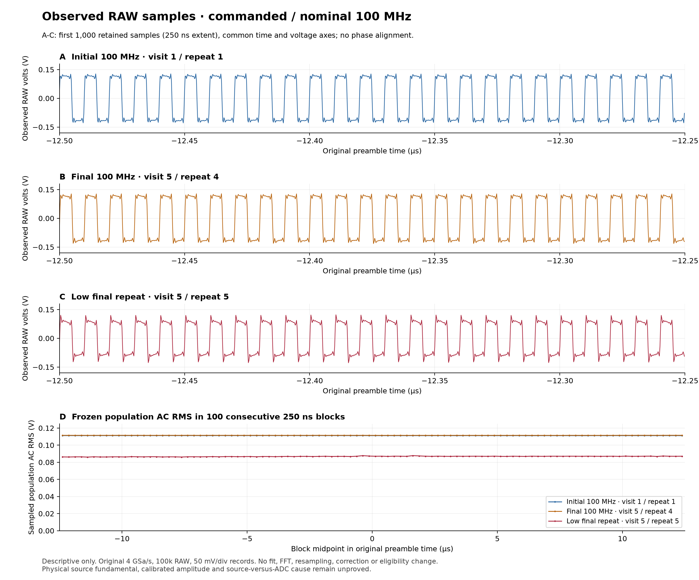

# Dedicated Linux bench controller

The operator selected a dedicated Rocky Linux workstation after shared-host
network changes interrupted RF acquisition. The specimen Ethernet cable is
disconnected during preparation. The earlier Mac diagnostic remains stopped;
its drafts and immutable evidence do not become a successful experiment through
this architecture change.

The bench host retains its Wi-Fi management connection. Its dedicated physical
Ethernet interface moves into a named Linux network namespace containing only
that interface and loopback. The namespace has a private address and connected
route, no default route, no management-facing virtual link, and no forwarding.
SSH controls processes on the bench host; ordinary ADB and SCPI sockets execute
inside the bench namespace. The workstation does not act as a router to the
instrument.

This uses the separation provided by Linux network namespaces and standard
`ip netns exec`, rather than a userspace TCP implementation. See the
[Linux namespace manual](https://www.man7.org/linux/man-pages/man7/network_namespaces.7.html)
and [ip-netns manual](https://www.man7.org/linux/man-pages/man8/ip-netns.8.html).
Existing host firewall and SELinux policy remain in place. Named ownership and
teardown are explicit, and relevant network profiles are preserved before the
interface leaves NetworkManager management.

Preparation installs the required capture and Python runtime packages from the
host's configured distribution repositories. Linux ADB is acquired from the
[official Android Platform Tools distribution](https://developer.android.com/tools/releases/platform-tools),
with its downloaded bytes, executable hash and reported version preserved.
Private SSH destinations, host paths and device-specific identities belong in
local evidence and configuration, not this description.

Host-only controls prove ordinary socket operation and graceful recorder exit
with recorded drop statistics. They supply no claim about specimen reachability
or RF response. A prepared DHCP configuration provides one MAC-bound private
24-hour lease without router or DNS options; no specimen service starts during
disconnected preparation.

Physical migration is a separate checkpoint: fresh capture first, explicit
operator Ethernet connection, then bounded lease and identity/transport checks.
The existing RF coax path and stock application, native, option and calibration
invariants remain unchanged. Moving the RF source's USB serial connection, if
needed for unattended acquisition, is another explicit setup transition.

The disconnected preparation passed its host-only control. A single loopback
TCP connection returned the exact 24-byte request and closed both directions.
The full capture contains ten complete frames; the recorder reported twenty
filter-received packets, zero kernel drops and graceful exit zero. These counts
have their own meanings and are not interchangeable. The management connection
remained available, root firewall rules compared byte-for-byte equal, and SELinux
remained enforcing. The prepared DHCP service was inactive.

The namespace service is active but is not enabled for automatic boot. Its
ownership record preserves the original NetworkManager and interface state.
Teardown was reviewed in source and has not been exercised. Host clock domains
were measured separately and must not be silently treated as synchronized.

Preparation evidence is `out/rf/linux-bench-preparation-01.toml`
(`0e672958ed89aa60c46907780ff06c6f58f46f7e7b8ac689ec2c9c9fcf3cac9d`,
44 files). Independent review is
`out/rf/linux-bench-independent-20261002T193500Z.toml`
(`2ceb818ce4e712b400da4fdf162a17fae98a2fe4a81f623d77ac0643fb3a1e3a`,
nine files). The accepted result is readiness for capture-first cable migration;
specimen reachability and RF response remain untested on this host.

The first transient recorder service stopped at systemd's `STDERR` setup
(`222/STDERR`) before tcpdump executed. No capture, DHCP, cable transition or
SCPI exchange occurred. The independently reviewed stop is preserved in
`out/rf/linux-link-01-armed.toml` and
`out/rf/linux-link-01-stop-independent-20261002T194100Z.toml`.
The path-context evidence does not distinguish ordinary permissions from
SELinux enforcement. The bounded successor uses journal stderr and a standard
service state directory, preserving the failed unit and host security policy.
It must prove actual capture readiness and graceful closure while disconnected
before a separate physical link checkpoint begins.

The journal-backed successor reached tcpdump but exited with a savefile
ownership error before capture. Its stop is sealed separately in
`out/rf/linux-recorder-service-control-02.toml`; neither failed service was
rerun. The next bounded control reuses the direct Python process-launch ancestry
that already passed the loopback recorder test. Standard tcpdump retains its
normal privilege handling; a timed supervisor records readiness, sends SIGINT,
and preserves the actual capture and exit/drop statistics. This changes the
launcher boundary without changing host security policy.

The direct Ethernet recorder control passed while disconnected: a valid 24-byte
Ethernet PCAP header, witnessed live child/namespace readiness, timed SIGINT,
exit zero and actual zero captured, filter-received and kernel-dropped packets.
No namespace helper or listener remained. Independent review accepted only
host recorder readiness (`out/rf/linux-recorder-direct-03.toml`,
`98e1346583c288d5d0b792c55755717861e53095dbdc16d6288b2e6e33b33f67`;
review `out/rf/linux-recorder-direct-independent-20261002T194900Z.toml`,
`3dfe5d42bcd704c376407f4f2d5f807ea696efd35c5b26a42574eee3f040808c`).
The generic launcher checks for statistics presence; actual drop counts remain
an explicit review condition. Fresh caller preflight and runtime ownership are
required before the separate physical cable cue.

The operator connected Ethernet to the dedicated bench port. Fresh carrier and
recorder checks passed before the prepared DHCP service started. The capture
contains a matching REQUEST/ACK for a private `/30` address, lease length
86,400 seconds, and no router or DNS options. Independent inspection accepted
that lease prefix before the sole ordinary TCP `*IDN?` transaction.

That transaction returned `RIGOL TECHNOLOGIES`, `MHO984`, and software prefix
`00.01.00`; the exact serial-bearing response remains private. This prefix does
not identify a complete firmware release or the loaded native bandwidth policy.
The final capture contains 44 complete frames: 11 DHCP, 19 IPv6 local control,
four ARP and ten TCP. Independent reconstruction verified the six-byte request,
50-byte response and complete TCP close. No extra application exchange or
unexpected external destination appeared in this capture.

The recorder and DHCP helper both exited zero. Recorder statistics were
44 captured, 44 filter-received and zero kernel drops. No namespace process or
listener remained; the ordinary TCP TIME_WAIT entry was recorded rather than
claimed absent. The namespace remains configured and isolated, with forwarding
disabled and no default route. The root namespace retains its management route.
No ADB, native-policy, UI or RF acceptance follows from this checkpoint.

Completed evidence is `out/rf/linux-link-02.toml`
(`25a2df7e69ec135cbf63a4c8f808734cce51cb9ff03b001466b51a7abd8dcc02`).
The immutable raw capture SHA-256 is
`598ebf05693cb723d259a64fa167f8c581a136b9a8283b13d439cac71f08da00`.
Independent completed review is
`out/rf/linux-link-02-independent-20261002T200100Z.toml`
(`23b76cc1776810c50424023975bcd73351b1b3e468f70eccb76ba8fc0d112fdb`).
The raw timestamps belong to the recorded Linux host clock domain; they are not
silently treated as synchronized workstation timestamps.

A conventional Linux ADB observation is prepared and independently accepted.
A host-only loopback control established a foreground server, loopback-only
listener and graceful SIGINT retirement. The supported discovery switches are
explicitly disabled. A numeric listen hostname was rejected by this ADB build;
the successful control uses `localhost`. Both outcomes remain preserved.
The ordinary `exec-out` client does not convey remote exit status reliably, so
zero-output remote checks require explicit completion markers.

The prepared observation starts full capture before one ADB connection, reads
UID first, and compares the exact accepted stock boot/process, APK/native mapping
and complete protected corpus. It requests one UI image and, only after those
gates, uses the already present fixed 16-byte stock policy reader. It introduces
no root restart, reboot, source command, RF sample or new warm-up claim. The
capture health token is created only after live recorder readiness. Cleanup
binds process ownership, retires the server and retains actual drop statistics;
uncertain retirement stops the run without an automatic reconnect.

Preparation is `out/rf/linux-stock-preparation-01.toml`
(`4387387b68906402e44eff8b71223db4218b0d3384a6bb5fc6047d4dc84b2307`),
coordinator preparation is `out/rf/linux-stock-controller-preparation-01.toml`
(`b08c80c989082ada362156c0d5bc4a53ae2812611025ba308fd8f9014772a240`),
and the concrete invocation is `out/rf/linux-stock-invocation-01.toml`
(`61abace532eb0d54b00b6786af5985c950aef79e203f2f28f619c4828dc914c8`).
Independent preparation review is
`out/rf/linux-stock-preparation-independent-01.toml`
(`c6c75f93a3faaa295d1f28e714502daad5fb8c1716a218886618e72c037fa446`).
These seals establish readiness for one observation, not current specimen or RF
acceptance. The RF source remains on its existing workstation serial connection;
no USB relocation is required for the proposed continuation.

The one Linux observation reached ADB with UID 0 and completed the stock checks.
The actual APK and embedded native bytes matched the preserved stock hashes;
the original boot/process and load mapping remained in place. All 32 accepted
corpus files matched before and after. The existing reader returned stock raw
and effective bandwidth values `17/17` within its fixed 16-byte read budget.
The single screenshot shows the normal scope UI with CH1 active. Its displayed
100 MHz measurement is supplementary and does not qualify a RAW waveform.
No source command, RF sample, root restart, reboot or new warm-up occurred.

The coordinator result remains `stopped`, exit one: a process ownership lookup found no executable for
the observer that was subsequently reaped with exit zero. The preserved evidence
is consistent with an exit race; scheduler timing is not independently proved. The preserved observer was reaped with
exit zero, and its guest reader and owned ADB server retired with exit zero.
Cleanup reported no issue. The recorder closed gracefully with 34,485 captured,
34,485 filter-received and zero kernel-dropped packets. The namespace remains
isolated. This distinction is retained rather than relabeling the supervisor
result or repeating the physical observation.

Actual evidence is `out/rf/linux-stock-actual-01.toml`
(`b72b6ceb13b8c7cc0986fbac2b97b54ba3a22ced622e0c87babcfa3a0f65bf27`).
Raw capture SHA-256 is
`3758fd84612b3fa8a0c5f10b8c900e63307d6352d3c545ed1d559ad7b539fbd7`.
Screenshot SHA-256 is
`92140d7bd853a010343d719ef4af62ee3354e75e22f2c27a4ec1c9cce9b9cfe1`.
Independent evaluation of the completed evidence is the next decision boundary.

Independent actual review accepts the stock evidence without repeating the run:
`out/rf/linux-stock-actual-independent-01.toml`
(`1291ea4a27b80d93afb441a2ea31aba19e668853c666621b51ef5aa0866586e0`).
Its complete capture scan found only one private ADB connection, with both TCP
FINs and no other protocol or destination. Recorded server exit and socket
absence are direct evidence; SIGINT is the pinned conditional cleanup path,
not a separately recorded signal event.

The next bounded batch prepares one stopped 100 MHz stock waveform diagnostic.
It keeps the existing source serial connection on the workstation and uses
ordinary Linux sockets for scope SCPI. Explicit run-bound receipts order the
sole source command and subsequent RAW acquisition. The existing diagnostic,
headroom, interpretation and restoration rules remain fixed; this one record
is not a slot in the 75-record comparison. The active three-hour work window
ends at 2026-10-02 23:05:20 UTC, with cleanup reserve retained.

The split-host diagnostic preparation passed independent review. The runnable
Linux delegate uses an owned ordinary ADB server and device-bound SCPI socket;
a single SSH channel carries explicit readiness and source completion receipts.
The source remains on the workstation. Focused controls cover framing, loss
without replay, deadline enforcement, directory ownership and child exit races.
Two concrete preparation defects were corrected before physical execution: an
import-only entrypoint and an absent barrier-directory creation step.

Linux preparation is `out/rf/linux-stopped-range-preparation-01/linux.toml`
(`fb7b378f748b644238af5890549c6b72dfaf0aefbf63e26066177b81a3eecec1`);
coordination is `out/rf/linux-stopped-range-coordination-preparation-01.toml`
(`b005b24efb812fce1a2782baef84e285c1e5a60010d9d6624921c373f4bb68a0`);
concrete host/config validation is
`out/rf/linux-stopped-range-preparation-01/root-inputs.toml`
(`390ef420524055441339990ef95a951766a74c62a3d8ee25d0325a512286eab4`).
Independent acceptance is
`out/rf/linux-stopped-range-preparation-independent-01.toml`
(`f33b4a8002062a243950a3b644ab165ddb861cae6d16ebf1c6afe3226223a18d`).

This same-epoch diagnostic inherits the accepted stock byte/corpus/policy/UI
evidence and rechecks process, boot and exact native mapping metadata three
times. It does not freshly detect an in-place backing-byte change. Full fresh
byte/corpus proofs remain required for later native transitions. No physical
waveform or comparison acceptance follows from preparation.

The one stopped acquisition completed with both controllers exiting zero. It
preserved one exact source attempt and one 100,000-sample RAW ASCII record at
4 GSa/s, acquisition count one and 100 mV/div. Original preambles match. The
complete ordinary and export settings restored exactly, the three stock
metadata epochs matched, and owned SCPI/ADB retirement completed before the
recorder closed. Actual statistics are 1,651 captured, 1,651 filter-received
and zero kernel-dropped packets. Root post-cleanup evidence shows no namespace
helper and unchanged isolation; ordinary TCP TIME_WAIT is retained.

Actual evidence is `out/rf/linux-stopped-range-actual-01.toml`
(`d6cfba0479fa3b48e14216f558c42ad212d10e9a4e01be35b00edd4fcde302bd`).
File-only numerical inspection is `out/rf/linux-stopped-range-analysis-01.toml`
(`e83d460aa581a75a545d233997592e93a923f9d1d6a1c3d7afa3dae42ea993ff`).
Both unchanged default and separate diagnostic receive profiles qualify the
record. Samples span -134.12 to +131.44 mV, with 265.56 mVpp and
111.42625005457596 mV demeaned population AC RMS. The strongest sampled
spectral bin is 100 MHz. These facts neither prove a calibrated source
fundamental/amplitude nor measure analog bandwidth. The record remains a
100 mV/div diagnostic, with zero original comparison slots. Independent
actual evaluation determines the next separately admitted experiment.

Independent completed review accepts the diagnostic and cleanup:
`out/rf/linux-stopped-range-actual-independent-01.toml`
(`5a07e523f7270d2e8fe44a5ae3712b2a1f8f7163ad72d2dd4a6e6c71039fb7c7`).
All stored frames reconstruct exactly one SCPI and one read-only ADB connection,
with both TCP FINs, no RST and no unexpected protocol or endpoint. The saved
request/reply bytes match the complete reconstructed SCPI streams.

The next batch prepares the original 25-record stock arm under 50 mV/div and
its unchanged range/receive/freshness/return-control rules. A separate offline
preparation adapts only the reviewed native-transition transport and host
evidence to Linux. Neither preparation grants a native mutation: B and A2
require accepted current inputs, separately admitted execution and the original
4,800/2,400-second time reservations within the active shorter deadline.

The original stock-arm preparation now passes independent review. It retains
five visits at 100, 800, 975, 1000 and 100 MHz, with five fresh stopped RAW
records per visit at 50 mV/div. The original built-in range veto and strict
sample limits remain. Each visit has one source attempt and a distinct sealed
receipt through the same SSH channel. Full twelve-row APK mapping checks and
complete ordinary/export restoration remain required.

Linux preparation is `out/rf/linux-stock-arm-preparation-01/linux.toml`
(`4bcb1819bae92573b206276b5c55170a72e959ce841923caa33dbcc3c8bc92ec`);
coordination is `out/rf/linux-stock-arm-coordination-preparation-01.toml`
(`df8aaedfeba987b767ce24458f11794256eed9f9b433b7d301ca8012ce415abe`);
concrete host/config validation is
`out/rf/linux-stock-arm-preparation-01/root-inputs.toml`
(`29dfad85323cfca087a9ac25f62c1a2a8a097770d7493792e30918b372b13c25`).
Independent review is `out/rf/linux-stock-arm-preparation-independent-01.toml`
(`2b3d8989633c19e5b4f8a3387c3ab5dbfd8b62f620cf95c695900f8b709d34ee`).

The public RAW parser runs unchanged during acquisition. Default receive and
comparison numerical interpretation run unchanged on the workstation after
capture; saved records remain unaccepted until those receipts and independent
actual review pass. The Linux layout is explicit and requires a reviewed
projection before the historical three-arm directory reducer can consume it.
No original comparison slot is claimed by preparation.

Offline native-boundary preparation preserves the original exact transaction,
byte hashes, protected-corpus exceptions, fixed reader budget and time gates.
It adds typed Linux authority and explicit remote shell completion framing.
The reviewed result is a partial adapter with a precise integration blocker,
not a runnable physical B/A2 controller. The acquisition supervisor's
900-second limit cannot cover the 1,801-second native warm-up; carrier/lease
health needs one narrowly bounded reboot phase, and owned DHCP plus live
captured REQUEST/ACK authority must still be composed. Fresh postboot byte,
policy, UI and corpus evidence remains required.

The boundary is `out/rf/linux-native-adapter-preparation-01.toml`
(`4ebcedf0fa3d4ff1a25fad5630a65b31c532edec438291e708abe194a4457735`),
independently reviewed by `out/rf/linux-native-adapter-independent-01.toml`
(`7efab62f18f01f5e3266c90f82cf804a33539f3a48840118a7047609758828af`).
The detailed integration design is `out/rf/linux-native-supervisor-design-01.toml`
(`b2bd855b61515f305a6b4053ac0dd87c0cc674a98e1888a2c78273ad368920a6`),
reviewed by `out/rf/linux-native-supervisor-design-independent-01.toml`
(`0f5ff8d09a34b2dea4c7f6be0ad8f252da3fafc11bfb6cf6e9189727571f2dd2`).
No native transition follows from these offline results.

The original stock arm completed once with all 25 RAW records preserved. Each
record passes the unchanged range and receive checks. The five visit means,
in commanded-frequency order, are 111.197, 100.762, 95.137, 90.834 and
106.513 mV AC RMS. These are observed sample statistics under the stock policy;
they do not establish calibrated source amplitude or analog bandwidth.

The arm fails its original return control. The final versus initial 100 MHz
mean is **-0.37378452327613054 dB**, outside the inclusive +/-0.3 dB limit.
The final visit's fifth record has 86.803 mV AC RMS; its other four records
have approximately 111.42--111.46 mV AC RMS. Independent calculation from all
original samples reproduces the failure. The lower record has complete source,
query and captured-response provenance and remains included. The evidence
does not establish whether the change arose in the source, receiver or export
path. No threshold change, record removal or retry is used to accept this arm.
Consequently A1 is not accepted, B/A2 have no records, and the 75-record policy
comparison remains unassessable.

Actual evidence is `out/rf/linux-stock-arm-actual-01.toml`
(`ecfdd871090bb765dab67dabedfad82cf79634167293f735cd1dad84166d6444`).
The unchanged numerical interpretation is `out/rf/linux-stock-arm-analysis-01.toml`
(`2bd4597d8d296b27447435f4dcb7ad7e2eaeac9db18343524eda2dcd3b05d4b8`).
Independent completed review is `out/rf/linux-stock-arm-actual-independent-01.toml`
(`972c5d16ff30ef1c32e9609a4db497456fe0273118b960d527924b35a9a24d17`).

The capture retains 14,579 captured, 14,579 filter-received and zero
kernel-dropped frames, with graceful recorder termination. Its two connections
reconstruct exactly the 385-command SCPI schedule and the read-only ADB
metadata checks; all 25 waveform replies match their saved bytes. Complete
ordinary/export settings restore, all three stock metadata epochs match, and
all owned helpers retire. The configured Linux isolation remains in place.
This run inherits accepted stock byte/corpus/policy/UI and thermal evidence;
it does not claim a new policy-memory observation or fresh backing-byte hash.

Further work in this batch is file-only examination of the failed control and
offline Linux supervisor composition. It does not authorize a native transition
from this failed stock arm.

The offline transition lease/health composition now passes ten focused owner
controls and four independent controls. It consumes a growing captured PCAP
stream once and preserves the original lease proof classes. One 180-second
reboot window may tolerate carrier loss before a fresh captured REQUEST/ACK;
all other isolation, ownership, recorder, clock and deadline guards remain
active. The captured ACK ends that exception immediately. A helper's sent-ACK
log cannot establish lease authority, and RELEASE after ACK or any DECLINE
stops the sequence.

The composition is `out/rf/linux-transition-lease-composition-01.toml`
(`ca027ef499b37af9440a35c6e4350cc381e66dc3d323af98b4072069024208e0`),
reviewed by `out/rf/linux-transition-lease-independent-01.toml`
(`723d198472bd5cf282ab81bb051e213b143b19766a8e079e45bb64953af9d143`).
These are supplied-byte and supplied-observation controls. They neither collect
runtime host state nor implement the complete packet allowlist. The strict
original minimal ACK option set also rejects renewal-timer options emitted by
the current DHCP service. That compatibility requirement must be resolved
explicitly before actual transition integration; no captured timer-bearing
ACK is silently promoted through this adapter.

Separate file-only inspection partitions three original 100 MHz records into
100 consecutive 1,000-sample blocks each (250 ns per block). The lower final
record's block RMS spans 86.039--87.793 mV, entirely below the reference final
record's minimum 111.405 mV. None of its blocks is constant or empty, while its
146.033 mV absolute peak exceeds the reference's 136.140 mV. Independent scalar
recomputation reproduces all 300 blocks. This describes a change across the
sampled record; it does not establish a source, ADC, filtering or export cause.

Forensic evidence is `out/rf/linux-stock-control-forensic-01.toml`
(`923febb8ac42dcc23be84bb68d50855a2b5408b425d20283ea5383261b5b2329`),
reviewed by `out/rf/linux-stock-control-forensic-independent-01.toml`
(`8401b7b68e5b9524feaf88c12b615f7767f69f1449fbee494a605e75a26e69fc`).

The next proposed diagnostic asks a different question from the failed arm:
with the existing 100 MHz command held and no source writes, do two RAW exports
of each frozen acquisition agree, and does RMS vary between fresh acquisitions?
Twenty fresh acquisitions with paired exports would distinguish repeat-read
inconsistency from variation between acquisition results. Equal pairs would
establish repeatability for those reads only; differing pairs would reveal
nominally stopped readout or hidden-state ambiguity. Neither result alone
would identify an analog cause. This separately tasked diagnostic has no
replacement comparison slots and cannot accept the failed A1.

The figure below shows the first 1,000 original samples from the three inspected
records, with common time/voltage axes and no phase alignment. Its lower panel
renders the sealed 100-block RMS sequences. The lower record retains periodic
edges and comparable peaks while its plateaus and RMS differ; the figure is
descriptive and does not assign a physical cause.

Figure provenance is `out/rf/linux-stock-control-figure-01.toml`
(`dc44bb456aa8defa40ab8cbd499943aa1d2a3f9e474939641ef5897204c7d311`).
The committed PNG is byte-identical to the sealed artifact
(`5b7895583cb3795f693e1d3312dd586d23ab7d3cc0fd2c8cdf906fc7095d891e`).
It uses original coordinates and frozen statistics, with no fitting, FFT,
resampling, normalization or eligibility change.

The distinct paired-export preparation is now reviewed and pinned. Source
inventory `out/rf/linux-frozen-export-preparation-01.toml` has digest
`459e68e3e937645ac72f73057a3c703a6f7b7172d99bdc46a06cef4914c778a0`.
Concrete host inputs `out/rf/linux-frozen-export-root-inputs-01.toml` have digest
`3762a956a54f16a160046f6004da8fa0f48ed01bce340a3d694cc493a6761736`;
independent preparation review
`out/rf/linux-frozen-export-preparation-independent-01.toml` has digest
`b3d7e18091799ce0e9f87967641c1c24650acbb5b6c4851b9079e22a11345805`.

Host-only validation confirms the preserved isolation, no active bench helper,
exact evidence/tool pins and sufficient bounded time. The source port remains
closed. Twenty acquisitions retain forty original replies, with no acquisition
or setting change between each stopped pair. Unequal pairs remain outcomes;
geometry, framing, range, health or deadline failure stops and preserves the
prefix. Original range guards and complete ordinary/export/run restoration
remain required. Preparation grants no accepted waveform, policy comparison
arm or physical cause.

The offline native lifecycle composition is complete and independently reviewed.
`out/rf/linux-native-supervisor-composition-01.toml`
(`370013e8a8e89b4d4a10b7df592b1f4f45114b5059eadd897a6c89632493ecbb`)
preserves the original native transaction and foreground callback bodies while
adding named phase evidence, durable partial results, reader retirement,
captured-lease gating, startup/UI and thermal sequencing. Fourteen focused
controls pass, independently reproduced in
`out/rf/linux-native-supervisor-independent-02.toml`
(`e73c7aaf75911beb2a391e234b3fcbc4d0e34334162ae35b9a6ac40fe5425831`).

This is executable composition with a supplied executor and a file-only CLI.
The actual foreground owner, packet/namespace collectors, full snapshot/UI
collectors and independent cleanup proofs remain integration work. Existing
DHCP renewal-timer options still require an explicit compatibility decision.
No device backend, accepted future arm or physical transition is created.
The failed original A1 and elapsed complete-sequence reserve both bar B in
this window.

Missing framed exec or transfer completion stops without replay. A reboot or
root request with uncertain client completion retains that uncertainty and
requires distinct captured lease, changed boot and UID readiness evidence;
the request is never repeated. Synthetic controls establish this sequencing,
not its physical behavior.

The composition decision retains two independent barriers to a physical B
transition: the original A1 return control failed, and the full-sequence time
reserve no longer fits. The paired-export diagnostic is a separate causal
question and supplies no comparison slots. Its numerical and wire review
comes next. Future transition execution requires a concrete reviewed backend,
accepted predecessor evidence and a new sufficient execution window; none is
created by accepting the offline library.

The separate physical paired-export diagnostic completed all twenty planned
fresh acquisitions and preserved forty RAW replies. Within every stopped
acquisition, both DATA replies are byte-identical, all three preambles agree,
and before/after geometry agrees. Independent reconstruction matches all
1,041 original SCPI commands and responses to the full capture. The recorder
closed gracefully with 23,816 captured, 23,816 filter-received and zero dropped
packets. Owned management endpoints retired before capture closure; the final
namespace has no helper processes. Transient TIME_WAIT is retained explicitly.

Across the twenty independent acquisitions, sampled AC RMS has mean
107.178 mV, population standard deviation 0.882 mV, minimum 104.851 mV and
maximum 108.037 mV. Both export streams produce exactly the same distribution.
Independent scalar recomputation of original samples agrees within
1.39e-17 V. All forty exports pass the unchanged numerical and reference guards;
all positions are retained, with no exclusions or replacement records.

This narrows the failure question: repeat-read inconsistency was not observed
in these twenty stopped pairs, while amplitude variation remains between fresh
acquisition results. It does not distinguish source, analog input, acquisition,
buffer selection or internal scaling causes. The previous 86.803 mV RMS record
did not recur in this batch. No new source command was issued, but the trial
included ordinary-setting normalization, particularly the original 1 MOhm input
to 50 Ohm before acquisition, and complete restoration afterward. It is not a
zero-intervention control; loading or settling remains an unresolved inference.

Actual evidence is `out/rf/linux-frozen-export-actual-01.toml`
(`7383fe078c3a5ef6d6101b4d0dc54298fe8603de752fe626d77689433fb20fe9`).
Numerical analysis is `out/rf/linux-frozen-export-analysis-01.toml`
(`4dc930a25acc09eba775fd9be8a36557b449f5aeed16ebf67ed6df6f072a6836`),
independently reviewed in `out/rf/linux-frozen-export-actual-independent-01.toml`
(`c5dbacb91b7c9b7be15c08409b3e17f137b6edbe08b049c66f8eb7a106a2cd8c`).
Stock epoch checks preserve the accepted process and twelve mapping rows;
current stock byte, policy, UI, protected corpus and thermal evidence remain
inherited rather than newly proven by those metadata checks.

The original failed A1 remains failed, with fifty B/A2 slots missing. This
diagnostic creates zero comparison slots and authorizes no native transition.
The next bounded question is offline: what does the stock RAW dispatch actually
promise about a stopped buffer and ASCII voltage conversion? Recovering that
narrow contract may identify a software ambiguity; static code alone cannot
assign a physical cause or correct the failed return control.

The [bounded stock waveform export contract](stock-waveform-export.md) is now
independently recovered from exact preserved APK/native bytes. Each selected
RAW read performs processing/export setup and a device-stream transaction.
Ordinary count one is a preamble default, not a hardware generation token.
WORD preserves selected bytes; ASCII already applies single-precision vertical
conversion and decimal formatting. The upstream driver/FPGA generation,
ownership and atomic metadata binding remain unresolved.

This supports an offline WORD framing/conversion oracle before any new bench
attempt. A future stopped WORD--ASCII--WORD bracket could test representation
agreement directly; it would still be separate device readout transactions.
No such capture, native transition or new RF-policy conclusion follows from
this recovery. The original failed return control and missing arms are retained.
