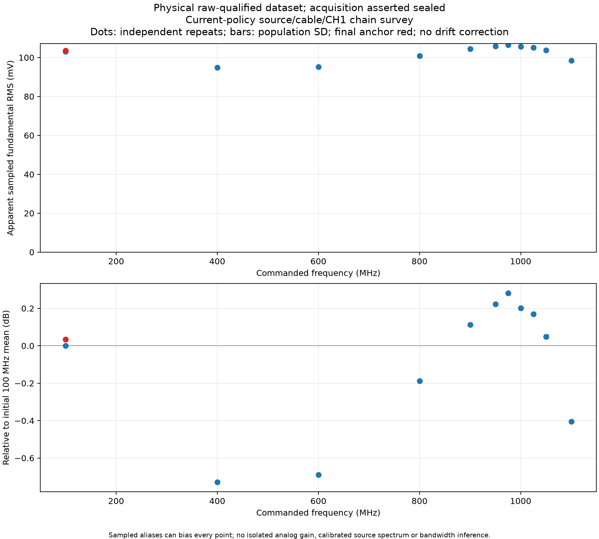
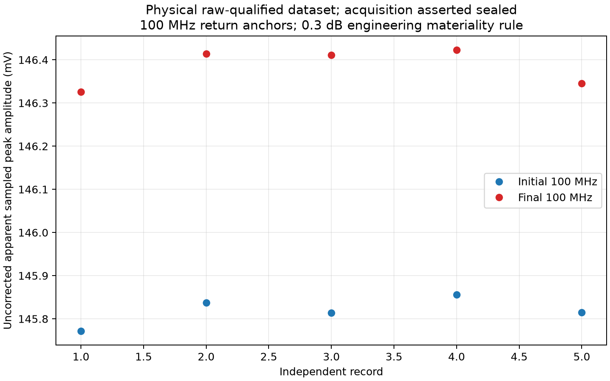

# Raw-qualified current-policy RF-chain survey

2026-10-01. The separately frozen
[raw-qualified protocol](rf-raw-qualified-survey-protocol.md) completed all twelve
visits and all sixty fresh RAW records. Every record passed the admitted sampled
receive criteria. This extends physical observation of the connected
source/cable/CH1 chain through the nominal 1.1 GHz command under the installed
software policy.

The [earlier survey](rf-current-survey.md) stopped at the built-in 600 MHz
frequency gate. Its records and conclusion remain immutable. The
[discriminator](rf-frequency-diagnostic.md) justified a new experiment using
supplied raw samples for qualification; no threshold was relaxed within a run.

The commanded visits were `100, 400, 600, 800, 900, 950, 975, 1000, 1025,
1050, 1100, 100` MHz, with five separate RUN/wait/STOP acquisitions at each.
CH1 remained internally terminated at 50 ohms with DC coupling, 1x ratio, zero
offset and FULL bandwidth. The temporary acquisition profile was 50 mV/div,
1 microsecond/div, 100k memory and reported 4 GSa/s. Each RAW ASCII record had
100,000 voltages and a 250 ps interval. ASCII voltages were retained directly.

The source received exactly one factory point command per visit at raw power
code zero. All twelve retained requests and driver-accepted byte sequences
match their expected nine-byte frames. These transport records provide no
serial device acknowledgement. The source ended at the planned 100 MHz return
visit; no retry or extra cleanup command was sent.

The committed [receive library](../../packages/mho-rf/README.md), introduced in
`0dba44e`, qualified each record online. Its explicit default profile fingerprint
was `25401a53b0b9b9a14581f740b5d8cf665ccfb2b37c962d925c77b46389409358`.
All sixty independent offline recomputations match the complete retained online
results. Each preamble/data/preamble file also matches its exact socket response,
with distinct waveform-query sequence numbers and recorded RUN/STOP transitions.
No record or scheduled visit is missing or censored in this acquisition.

The fresh full Layer Two capture retained 91,848 frames in 91,566,306 bytes.
The recorder exited gracefully with zero reported kernel drops. Reconstructed
TCP streams match all 610 retained request files (9,990 bytes) and 458 response
files (84,010,572 bytes), including both connection termination directions.
These are stored-frame, process and transcript observations; they do not prove
that every frame on the wire was captured.

Acquisition began at 22:58:35 UTC and all visits completed at 23:04:58 UTC.
At 23:05:06 UTC, readbacks confirmed the original scope and export settings were
restored: 500 mV/div, 10 ns/div, 10k memory, reported 4 GSa/s, running acquisition,
and the original normal/WORD waveform export extent. The temporary host address
was removed, the lease helper stopped, and host isolation checks passed. Wiring,
firmware, capability policy, entitlements and calibration were unchanged. These
are SCPI and host observations; no live camera UI witness was available.

The private acquisition root is
`out/rf/raw-qualified-survey-20261001T224500Z`, with a separate manifest at the
same name plus `.toml`. Its verified manifest SHA-256 is
`9ca142a9fafc0d810469e22aa2ecd20f9ea72318f8203c5a61ad0029673d4ec9`
over 1,710 artifacts and 281,077,070 bytes. The capture SHA-256 is
`a2b1cc3b4192c94ff3ad4b956ef7ca262e57ceeb74b2eb9f3a822a2527f69965`.
Unit identity and host/interface details remain in local evidence.

Final command-centered estimation follows this seal in a separate derived root.
Receive acceptance establishes a dominant sampled component near each command;
it does not establish physical carrier origin, calibrated amplitude or valid
final fits. Source/cable response, clock uncertainty, folded harmonics and the
missing matched software-policy comparison remain explicit limits.

## Sealed numerical finding

The frozen command-centered +/-0.01% fits accepted all sixty records, with no
boundary, competing-solution, rank or finite-order alias flags. The table reports
five-record means and population standard deviations of the apparent fitted
peak. These dispersions describe repeatability rather than total uncertainty.

| Command (MHz) | Fitted mean (MHz) | Apparent peak mean (mV) | Population SD (mV) | Relative to initial 100 MHz (dB) |
| --- | --- | --- | --- | --- |
| 100 initial | 100.002089 | 145.818824 | 0.028251 | 0.000000 |
| 400 | 400.008365 | 134.082086 | 0.017397 | -0.728857 |
| 600 | 600.012590 | 134.690552 | 0.010792 | -0.689529 |
| 800 | 800.016815 | 142.693135 | 0.070573 | -0.188210 |
| 900 | 900.018927 | 147.722275 | 0.015443 | +0.112648 |
| 950 | 950.019917 | 149.617090 | 0.022856 | +0.223352 |
| 975 | 975.020547 | 150.608021 | 0.039991 | +0.280690 |
| 1000 | 1000.021053 | 149.249978 | 0.059436 | +0.202014 |
| 1025 | 1025.021544 | 148.698639 | 0.076474 | +0.169868 |
| 1050 | 1050.022224 | 146.640922 | 0.166732 | +0.048832 |
| 1100 | 1100.023068 | 139.165363 | 0.007887 | -0.405649 |
| 100 return | 100.002103 | 146.383806 | 0.039948 | +0.033589 |

The uncorrected return-anchor difference is +0.033589 dB, below the frozen
0.3 dB engineering materiality threshold. No drift interpolation or amplitude
correction was applied. All sixty waveform byte hashes are distinct.

The built-in frequency strings again disagreed substantially with the raw
component: 600 MHz read 571.43 MHz, 900 MHz read 444.44 MHz, 1050 MHz read
333.33 MHz, and 1100 MHz read 363.64 MHz. They remain retained observations.
The fits inherit the reported sample clock and lie about 20.66–21.31 ppm above
their commands; this does not identify which clock contributes the offset or
calibrate either clock.

All order-one-through-nine sensitivity models had numerical rank 19/19, with
conditions between 1.414228 and 1.469053. Actual fitted detuning separates modeled
aliases that would coincide at exact nominal frequencies. For example, the first
1 GHz record's nearest modeled class is roughly 85.10 kHz from its fundamental,
versus the 40 kHz inverse-duration scale. This supports the finite model's
numerical decomposition; omitted folded energy and unrelated nearby components
remain unbounded. A small residual does not prove spectral purity or isolated
analog gain.

The separately sealed derivative is
`out/rf/raw-qualified-survey-derived-20261001T231000Z`, with verified manifest
SHA-256 `c5e74646fb343244acf9ba5185b835f09482304084cf854b3dbb39f0c15ad557`
over 113 files and 18,523,631 bytes. Its frozen reducer hash is
`4d1d39dbab2aaef88c2e6d8774cac48803435b412a8df2c14f6a00f79b0cbb40`.
It preserves all repeats, exact receive-receipt reconciliation, grids/minima,
finite-order classes, controls, runtime and source. The acquisition seal was
verified unchanged before and after reduction.

The conclusion is useful reception and repeatable apparent sampled response
through the nominal 1.1 GHz command under the current software policy. The
original matched-policy gate remains open: this dataset contains one software
arm, and source/cable response is not calibrated away. The next small control is
a fixed 975 MHz ordinary channel-limiter comparison, OFF → 250M → OFF, using
whole-record demeaned AC RMS so suppressed noise cannot be promoted into a
carrier fit. Its thresholds and condition-specific low-signal rules require
separate admission before execution.

Subsequent checkpoint: that control was separately admitted and completed. Its
[fifteen-record result](rf-limiter-control.md) demonstrates a large reversible
change in sampled AC output with the ordinary limit selection. The software
policy remained fixed; the matched-policy gate remains open.
