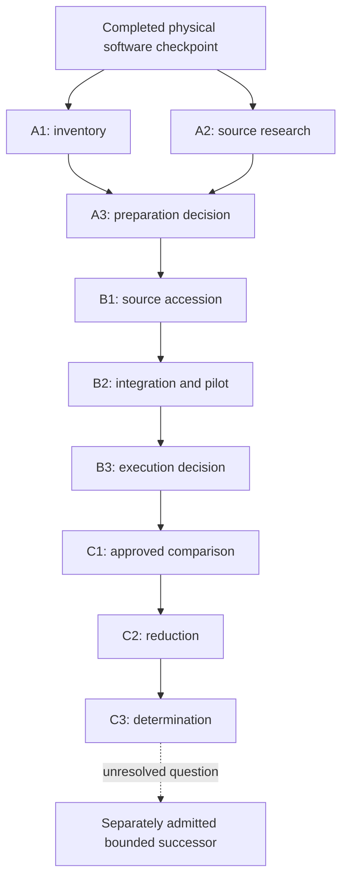

# Actual RF response under the selected capability policy

Planning baseline: 2026-09-30. `ROADMAP.rf-response` is the current line of advance. Its objective is to determine
what the selected software capability changes in the instrument's measured RF response, including at 1 GHz.
Physical software enablement and persistence are already established. No RF result is implied by this roadmap.

The roadmap has three phases and nine tasks. Each phase has two work tasks and a decision task. One roadmap keeps
the equipment preparation and experiment attached to the same question; three epics group their distinct scopes.
The separate emulator, crash-cart and general tooling programs are not prerequisites for this milestone.

## Starting evidence and scope

- [Physical D-capability and persistence](physical-d-capability.md) establishes the recorded 18/18 software state,
  preserved public identity, ordinary options and signed APK. It also describes the rollback boundary.
- [Stage 5 evaluation plan](rf-performance-evaluation-plan.md) supplies the initial measurement rationale,
  single-channel comparison, raw-waveform reduction, uncertainty terms and stock/derived/stock design.
- [RF source research](rf-source-research.md) distinguishes candidate board families, incompatible serial protocols
  and the source constraints to verify before choosing the physical protocol.
- The present roadmap adapts that proposal to equipment actually available. The older plan remains a dated
  planning baseline; it is not an executed protocol or an inventory of the current bench.

Admission establishes task contracts. This planning session does not operate the source or scope. Physical tasks
require an explicit record of the operator-authorized procedure and transitions before execution. Reuse applicable
authorization already granted; do not request the same approval twice. Planning permission alone does not supply
authority for new RF connections, software transitions, calibration or instrument operations.

Purchase receipts, BOM workbooks, personal information, unit identifiers and detailed local inventory stay outside
tracked source. Use ignored `out/rf/` evidence for inventory and run artifacts. Public reports may describe equipment
classes and relevant specifications without copying private purchase records. Ordered, delivered, on-hand,
inspected and qualified are distinct states, each with dated evidence; an order does not prove bench readiness.

## The questions and allowable claims

**Policy effect:** under matched source, signal-path and acquisition conditions, does the verified derived policy
produce a repeatable response change relative to verified stock policy at the declared high-frequency points?
The candidate hypothesis is an increase around and above 800 MHz, including 1 GHz. A difference below the declared
resolution, a decrease, or a baseline that does not repeat can falsify or leave that hypothesis unresolved.

**Absolute response:** if the delivered fundamental amplitude and uncertainty can be established, does the derived
response meet the declared -3 dB criterion at 1 GHz relative to a justified low-frequency reference? This is a
separate question from whether the policy causes an improvement. Stock may already meet the selected-point target.

Phase A chooses the initial claim scope; phase B freezes it against actual equipment before comparative data are
taken. An uncalibrated source can support a bounded relative comparison if stability, spectral ambiguity, loading
and acquisition effects are adequately controlled. Its frequency or amplitude display does not establish delivered
fundamental amplitude, and seeing a waveform at 1 GHz does not establish 1 GHz bandwidth.

Do not make a calibrated absolute-response chain a universal prerequisite for a useful relative experiment.
Conversely, do not promote relative improvement into an absolute bandwidth result. A single-channel, single-scale
result does not certify all channels, gains, temperatures, acquisition modes or enabled features.

## A. Pre-arrival preparation

Epic: `EPIC.rf-preparation`. These tasks can proceed without contacting hardware.

| Task | Transition and deliverable |
| --- | --- |
| `TASK.rf.inventory` | Reconcile existing private evidence and operator reports into a dated capability inventory. |
| `TASK.rf.source-research` | Turn source documentation into constraints and an explicit arrival checklist. |
| `TASK.rf.preparation-decision` | Select a feasible first question and issue a provisional experiment protocol. |

The inventory covers available measurement instruments, source/reference options, STM32 boards, 50-ohm cables,
SMA/BNC adapters, terminations, attenuators, power, waveform export and display capture. Record connector types,
usable frequency/level ranges, calibration or verification status, and unknowns. Separate items needed for the first
comparison from optional improvements and unrelated future infrastructure. Ask only for missing bench facts that
can change the first experiment; do not require a complete catalog of the laboratory.

Source research distinguishes the advertised SG6000/MAX2870 board from the IC datasheet and from third-party
examples. Determine what documentation actually supports about output level, reference clock, usable fundamental
range, harmonics/spurs, sweep/settling, connectors and startup/output behavior. Preserve unknown board details for
arrival inspection. Custom STM32 control and external reference modifications are optional follow-on work.

In particular, re-evaluate the older plan's 10 MHz anchor against the candidate source's actual minimum frequency.
Choose and justify a common reference within the usable source range, or explicitly characterize any second-source
substitution. A separate clock output must not silently bridge an unmeasured amplitude difference between sources.

The phase-A decision specifies provisional hypotheses, frequency points, repeat counts, fundamental-amplitude
estimation, software-state comparison, drift checks, result categories and the smallest missing capabilities.
It drafts the bench connections, level budget, warm-up, stop/cleanup conditions and intervention list for review.
It identifies what can be settled now and exactly what arrival must resolve. An arrival dependency is an honest
handoff, not a reason to build unrelated infrastructure while waiting.

## B. Arrival preparation and integration

Epic: `EPIC.rf-integration`. Details remain conditional on phase A and the delivered source.

| Task | Transition and deliverable |
| --- | --- |
| `TASK.rf.source-accession` | Identify the delivered source and qualify its proposed role with retained evidence. |
| `TASK.rf.integration` | Demonstrate the approved signal path and acquisition/export procedure at pilot settings. |
| `TASK.rf.execution-decision` | Freeze an executable protocol and decide whether measurement may begin. |

Source accession records the delivered model/revision, supplied manual, connectors, output controls, power and
startup behavior. Compare these with advertised assumptions. Begin with the source isolated from the scope.
Perform only approved source checks; record what remains unmeasured when suitable independent instruments are
unavailable. Arrival is not a declaration that output power, frequency accuracy or spectral purity is known.

Integration proves only what the chosen experiment needs: a defined 50-ohm path and level budget, repeatable
settings, suitable acquisition rate and record length, and retained waveform bytes with scaling/preamble metadata.
Pilot data are labeled as such and do not become post-hoc confirmation data. Use existing controls and manual
operation where practical. Add a small reusable component only if a demonstrated gap prevents this measurement.
Screenshots support settings/UI observations; HDMI capture and a USB crash cart are not required for waveform data.

The execution decision must resolve all of the following for the selected claim scope:

- Exact question, scope, frequency grid, repetitions, reference point, effect threshold and uncertainty treatment.
- Source/path suitability, level/termination limits, warm-up and thermal/drift witnesses; remaining limitations.
- Exact software arms, identity/hash/policy checks, acquisition settings, transition/reboot and rollback procedure.
  The scope's FULL bandwidth setting alone is not evidence of switching stock versus derived native policy.
- Calibration and option-state preservation, waveform export/analysis controls, capture health and run storage.
- Accepted physical operations, stop conditions, permitted recovery and intended final bench/software state.

Use stock/derived/stock as the default design to test both a policy effect and baseline repeatability. The specimen
was last left in the derived state; the initial stock transition therefore needs its own verified procedure.
If the arm order changes, document why it still answers the question. Restoring the derived state after the final
stock measurement must be explicitly included or omitted in the accepted plan, not performed silently.

Close the execution gate only with a supported go decision and applicable operator authorization. A hold/no-go
remains an open gate with the exact missing condition recorded. A bounded remedy can be admitted and linked as a
prerequisite through taskctl revision, review and reconciliation. Dependent tasks must not infer permission from
taskctl readiness or treat a failed gate as successful because its review was written down.

## C. Experiment execution, measurement and determination

Epic: `EPIC.rf-measurement`. Execute one frozen experiment, then evaluate before admitting an iteration.

| Task | Transition and deliverable |
| --- | --- |
| `TASK.rf.acquire` | Execute the approved comparison and seal its raw evidence, including any aborted run. |
| `TASK.rf.reduce` | Derive response, repeatability, drift and supported uncertainty from sealed evidence. |
| `TASK.rf.determination` | Answer the declared questions and close the milestone or specify one bounded successor. |

The acquisition task records actual settings and software state for each arm, raw waveforms and preambles,
source/reference observations, timing and environment, plus raw management transcripts and recorder statistics
where those interfaces are used. Preserve failed attempts separately. Stop on unexpected state changes, capture
failure, overload, unplanned termination changes or inability to establish the declared state. Perform only the
accepted cleanup/recovery; record the final state even after a partial experiment.

The reduction task uses the frozen estimator and normalization, rejects incomplete/decimated/mis-scaled records,
and retains residuals, repeat dispersion and baseline-return differences. Exercise the estimator against synthetic
known-amplitude records and malformed/incomplete inputs before interpreting the physical dataset. Analyze missing
arms as missing; do not interpolate them into existence. Keep relative ratios and any corrected absolute response
separate, and account for uncertainty terms that do not cancel in a ratio.

The final decision reports policy effect as demonstrated, not resolved at the experiment's sensitivity, contrary
to the proposed increase, or unassessable because controls failed. The absolute-response result is independently
met, missed, inconclusive or not assessed. A negative experiment is valid progress. An inconclusive result names
the uncertainty that prevented a decision and the smallest additional observation needed to resolve it.

Do not change the hypothesis or append new frequency points to the same completed experiment because its result
was disappointing. Preserve the result, evaluate it, and admit a separately identified successor if justified.
Any follow-up uses plan inspection, expected-revision admission and committed tasking before execution. Amend
roadmap membership explicitly; do not leave successor tasks outside the named line of advance.

Closing the determination task means the evidence was evaluated. The milestone disposition must separately say
whether the question is answered, needs a bounded follow-up, or is deferred by the operator. Neither all tasks
being closed nor a positive software enum makes the RF milestone successful automatically.

## Dependencies and timing

Roadmap and epic memberships are organizational. The `requires` edges in the task contracts establish ordering.
Only inventory and source research are initially ready. Later contracts are deliberately conditional; use taskctl
revision and reconciliation if equipment evidence changes their scope before execution.

Prioritize phase A before arrival, then the smallest qualifying phase B and one phase-C comparison. Plan for a
focused preparation block and an afternoon-sized bench session, with source settling, warm-up, reboots and analysis
included. These are scheduling allowances, not promised durations. At the phase-A handoff, revise the estimate from
actual missing equipment and operator availability. Delay optional automation, clock redesign and broader lab
infrastructure unless a concrete measurement blocker establishes their value.

Commit and push admission before executing tasks. Preserve meaningful findings and phase decisions with taskctl
receipts and commit/push checkpoints; do not interrupt a running acquisition merely to produce a Git checkpoint.
Keep raw evidence and private inventory local, and publish only sanitized methods, findings and claim limits.

Task contracts: [RF response task set](../../.agents/plans/rf-response.yaml).
